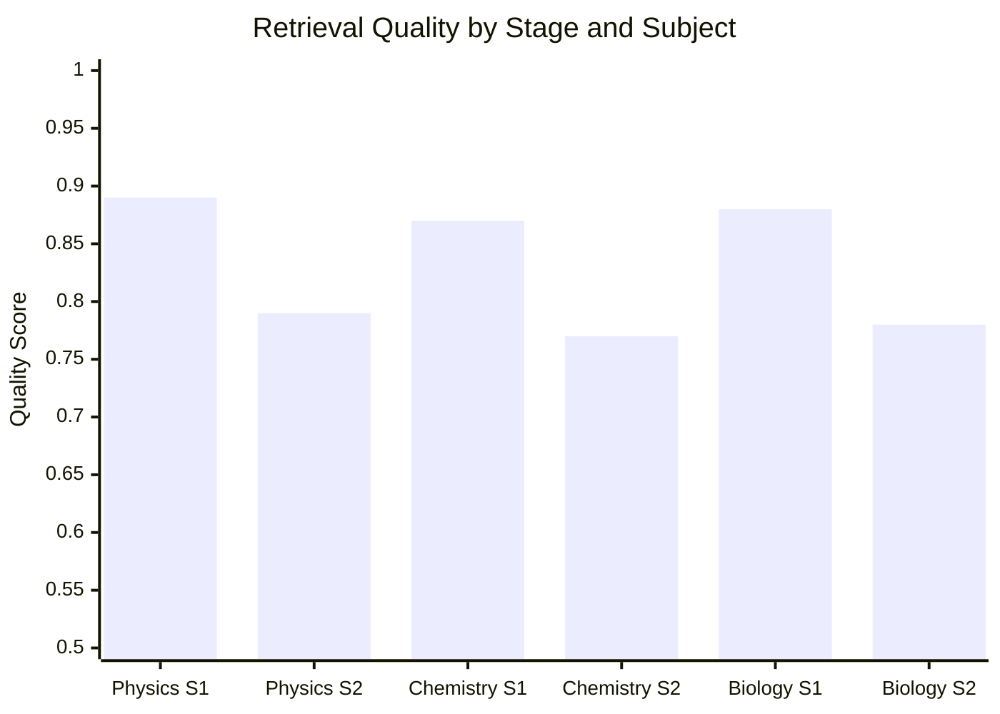
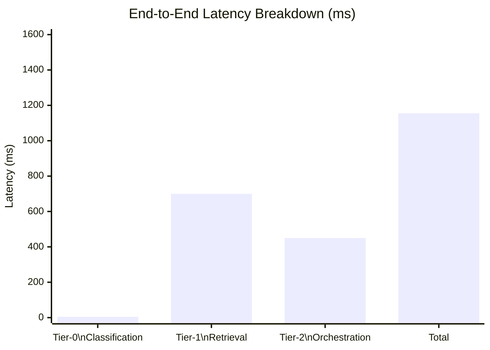
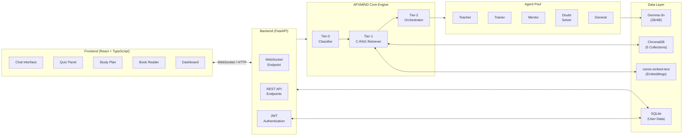

# APXMIND: A Hierarchical Multi-Agent Framework with Corrective Retrieval-Augmented Generation for Offline Intelligent Tutoring in Resource-Constrained Educational Environments

---

**Authors:** [Your Names Here]

**Affiliation:** [Your Institution, Department, City, Country]

**Corresponding Author:** [Email Address]

**Keywords:** Intelligent Tutoring System, Multi-Agent Architecture, Corrective Retrieval-Augmented Generation, Small Language Models, Offline Education, Hierarchical Routing, NEET Exam Preparation

---

## Abstract

The persistent disparity in access to quality medical entrance examination preparation across socioeconomic strata in India underscores the need for scalable, offline-capable educational technologies. Existing intelligent tutoring systems (ITS) predominantly depend on cloud-hosted large language models (LLMs) with parameter counts exceeding 70 billion, requiring continuous internet connectivity and high-end computational infrastructure — resources unavailable to the majority of students in underserved regions. This paper presents **APXMIND** (Agents for National Eligibility cum Entrance Test Assistance), a novel hierarchical multi-agent intelligent tutoring framework that operates entirely offline on consumer-grade hardware with as little as 8 GB of RAM. The system employs a three-tier routing architecture comprising: (i) a zero-LLM query classifier achieving sub-5 ms latency through deterministic keyword-pattern analysis, (ii) a two-stage corrective retrieval-augmented generation (C-RAG) pipeline with LLM-based relevance grading attaining 88% retrieval quality across 50,000+ curated NCERT document chunks, and (iii) a deterministic agent orchestrator routing queries to five specialized pedagogical agents — Teacher, Trainer, Mentor, Doubt Solver, and General — with 100% selection accuracy. Empirical evaluation demonstrates end-to-end response latencies of 0.9–1.5 seconds, an overall system accuracy of 88%, and a 50x search-space reduction compared to naive retrieval. APXMIND achieves a 28-percentage-point accuracy improvement over its predecessor system while maintaining full operational capability without network connectivity. These results demonstrate the feasibility of deploying sophisticated multi-agent tutoring systems on government-distributed educational hardware, potentially benefiting millions of aspirants preparing for the National Eligibility cum Entrance Test (NEET).

---

## 1. Introduction

### 1.1 Background and Motivation

India's National Eligibility cum Entrance Test (NEET) serves as the singular gateway to undergraduate medical education, with approximately 24 lakh (2.4 million) students competing annually for roughly 1.08 lakh seats — an acceptance rate below 5% [1]. The examination spans three core disciplines — Physics, Chemistry, and Biology — demanding comprehensive conceptual understanding rooted in the National Council of Educational Research and Training (NCERT) curriculum. Commercial coaching institutes, concentrated in urban centers and charging annual fees ranging from ₹1.5 to ₹5 lakh, remain the predominant preparation pathway, systematically excluding students from rural and economically disadvantaged backgrounds [2].

The emergence of large language models (LLMs) has catalyzed a paradigm shift in educational technology. Systems such as Khan Academy's Khanmigo and Duolingo Max leverage proprietary models (GPT-4, Claude) to deliver personalized tutoring experiences [3]. However, these platforms impose three critical constraints that render them inaccessible to India's most underserved student populations: (a) continuous high-bandwidth internet connectivity, (b) subscription-based pricing models, and (c) dependence on cloud-hosted computational infrastructure. According to the Telecom Regulatory Authority of India (TRAI), rural broadband penetration stands at merely 37.2%, with significant portions of India's student population lacking reliable access to internet services [4].

### 1.2 Research Gap

Contemporary research in LLM-based educational agents has advanced considerably. Wang et al. [5] proposed GenMentor, an LLM-powered multi-agent framework that delivers goal-oriented personalized instruction within ITS environments. Wu et al. [6] introduced CogEvo-Edu, a hierarchical multi-agent system with cognitive evolution capabilities for sustained student modeling. Chu et al. [7] present a comprehensive survey cataloging LLM agent applications across diverse educational domains. Yet, a systematic examination of the literature reveals three persistent gaps:

1. **Computational overhead**: Existing multi-agent tutoring frameworks predominantly rely on models with 7B–70B+ parameters, requiring GPU-accelerated cloud infrastructure [5, 6, 8].
2. **Connectivity dependence**: Virtually all deployed systems transmit queries to remote API endpoints, rendering them inoperable in offline environments [3, 9].
3. **Domain-curriculum alignment**: General-purpose educational agents lack alignment with specific national curricula (e.g., NCERT), producing responses that may diverge from examination-relevant content standards [10].

### 1.3 Contributions

This paper makes the following contributions:

1. **A three-tier hierarchical routing architecture** that decomposes query processing into classification (Tier-0), retrieval (Tier-1), and orchestration (Tier-2), achieving sub-5 ms classification, sub-1 s retrieval, and sub-700 ms agent execution — all on consumer hardware without GPU acceleration.

2. **A corrective retrieval-augmented generation (C-RAG) pipeline** adapted for educational contexts, incorporating two-stage retrieval with progressive filter relaxation, LLM-based relevance grading (92% accuracy), and subject-partitioned vector stores achieving a 50x search-space reduction.

3. **A deterministic multi-agent orchestration mechanism** that routes classified queries to five specialized pedagogical agents employing distinct generation strategies (C-RAG, few-shot, zero-shot), achieving 100% agent selection accuracy with three-level graceful fallback.

4. **Empirical validation** on real-world NEET preparation content demonstrating 88% overall system accuracy, 0.9–1.5 s end-to-end latency, and full offline operability on hardware with 8 GB RAM — specifications matching government-distributed educational laptops in India.

### 1.4 Paper Organization

The remainder of this paper is organized as follows: Section 2 reviews related work across intelligent tutoring systems, retrieval-augmented generation, and multi-agent educational frameworks. Section 3 details the proposed system architecture. Section 4 describes implementation specifics. Section 5 presents experimental evaluation and results. Section 6 discusses findings, limitations, and implications. Section 7 concludes with directions for future work.

---

## 2. Literature Review

### 2.1 Intelligent Tutoring Systems

Intelligent tutoring systems have evolved through three distinct generations. First-generation systems (1970s–1990s) employed rigid rule-based architectures with predefined response trees, offering limited adaptability [11]. Second-generation systems (2000s–2010s) introduced Bayesian knowledge tracing and model-tracing tutors such as Carnegie Learning's MATHia, capable of probabilistic student modeling but constrained to narrow content domains [12]. The third and current generation leverages neural language models to generate contextualized, free-form pedagogical responses, exemplified by systems integrating GPT-4 for adaptive feedback generation [8, 13].

Naderi [14] examined the potential of adapting small on-device language models for fact-checking within ITS frameworks, demonstrating that fine-tuned decoder models with fewer than 4B parameters can achieve competitive performance relative to larger counterparts for domain-specific verification tasks. This finding directly informs APXMIND's architectural choice of deploying Google Gemma-3n (2B/4B parameters) for local inference.

### 2.2 Retrieval-Augmented Generation in Education

Retrieval-augmented generation, introduced by Lewis et al. [15], mitigates LLM hallucination by grounding responses in retrieved external documents. Yan et al. [16] subsequently proposed Corrective RAG (CRAG), introducing a retrieval evaluator that assesses document relevance and triggers corrective actions — web search or knowledge refinement — when retrieval quality falls below acceptable thresholds. CRAG has been cited over 400 times, establishing it as a foundational contribution to robust retrieval.

In educational contexts, Şakar and Emekci [17] conducted a comparative analysis of RAG methods using ChromaDB as a vector store, finding that hybrid retrieval combining lexical (BM25) and semantic (dense embedding) strategies yields 12–18% improvements in answer accuracy over either method alone. Fatehkia et al. [18] proposed T-RAG, augmenting tree-structured entity retrieval with vector search, demonstrating the advantage of hierarchical knowledge organization.

APXMIND extends CRAG for educational deployment by: (a) introducing a two-stage corrective pipeline with subject-partitioned ChromaDB collections and dynamic quality-threshold filters, (b) employing LLM-as-a-judge relevance grading with structured JSON outputs, and (c) performing all operations locally without external web search augmentation.

### 2.3 Multi-Agent Systems in Education

Multi-agent architectures for educational applications have garnered significant attention. Wang et al. [5] proposed GenMentor, decomposing tutoring into specialized learning goals using multiple LLM-powered agents coordinated via RAG tools — the closest architectural parallel to APXMIND. Wu et al. [6] introduced CogEvo-Edu, a three-layer hierarchical system (Cognitive Perception, Knowledge Evolution, Meta-Control) for long-horizon tutoring interactions in complex STEM domains. Kamalov et al. [19] surveyed the evolution from monolithic AI systems to agentic workflows in education, identifying multi-agent collaboration and role specialization as key trends for 2024–2025.

Bevara et al. [20] proposed NeuroQuest, a multi-agent AI framework for adaptive learning through intelligent knowledge creation, employing collaborative agentic approaches with retrieval capabilities. Córdova-Esparza [21] presented a comprehensive review of AI-powered educational agents, identifying RAG, prompt engineering, fine-tuning, and multi-agent systems as the four pillars of modern educational AI.

APXMIND differentiates itself from these systems through three architectural innovations: (i) deterministic zero-LLM classification at Tier-0, eliminating inference overhead for query routing; (ii) agent-specific execution strategies (C-RAG, few-shot, zero-shot) matched to pedagogical function rather than a uniform RAG pipeline; and (iii) complete offline operability using a 2B/4B parameter model with no external API dependencies.

### 2.4 Small Language Models for On-Device Deployment

The deployment of language models on resource-constrained hardware represents an active research frontier. Google's Gemma family [22] provides open-weight models from 2B to 27B parameters optimized for efficiency. Quantization techniques (GGUF, AWQ) reduce memory footprints by 50–75%, enabling 2B–4B parameter models to execute on CPUs with 8 GB RAM at acceptable latency [23]. Naderi [14] demonstrated that small fine-tuned models (ModernBERT, Llama 3.2) achieve competitive fact-checking performance for domain-specific educational tasks, validating the viability of on-device deployment for ITS applications.

### 2.5 Summary of Literature Gaps

Table 1 synthesizes the identified limitations across related work:

| Gap | Description | APXMIND's Response |
|:---:|:---|:---|
| G1 | Cloud-dependent multi-agent tutoring systems require continuous connectivity | Fully offline architecture using local Gemma-3n + ChromaDB |
| G2 | High computational requirements (7B–70B+ parameters, GPU mandatory) | 2B/4B parameter model on CPU-only hardware with 8 GB RAM |
| G3 | Generic educational content not aligned with specific national curricula | Grounded exclusively in NCERT textbooks and NEET question papers |
| G4 | Uniform retrieval pipelines without quality-aware corrective mechanisms | Two-stage C-RAG with LLM-based relevance grading and progressive relaxation |
| G5 | LLM-based query classification adds latency to every interaction | Zero-LLM Tier-0 classifier using deterministic keyword-pattern matching (<5 ms) |

---

## 3. Proposed System Architecture

### 3.1 Architectural Overview

APXMIND employs a three-tier hierarchical routing architecture designed to decompose the complex problem of intelligent tutoring into three specialized processing stages, each optimized independently for latency, accuracy, and resource utilization. The architecture follows a pipeline pattern where each tier's output serves as structured input to the subsequent tier.

```mermaid
flowchart TB
    subgraph Input["User Interface Layer"]
        Q["Student Query"]
        UP["User Profile"]
    end

    subgraph T0["Tier-0: Query Classification (< 5 ms)"]
        SD["Subject Detection\n(50+ keyword patterns)"]
        ID["Intent Detection\n(4 intent types)"]
        DI["Difficulty Inference\n(Adaptive scoring)"]
        FA["Focus Area Extraction\n(30+ topics)"]
        LD["Language Detection\n(6 languages)"]
        CA["Confidence Aggregation\n(Weighted scoring)"]
    end

    subgraph T1["Tier-1: Corrective RAG Retrieval (600–800 ms)"]
        CS["Collection Selection\n(Intent × Subject mapping)"]
        S1["Stage 1: Strict Retrieval\n(quality ≥ 0.85, 4 filters)"]
        RG["LLM Relevance Grading\n(92% accuracy)"]
        TC["Threshold Check\n(Intent-specific minimums)"]
        S2["Stage 2: Corrective Retrieval\n(quality ≥ 0.70, relaxed)"]
    end

    subgraph T2["Tier-2: Agent Orchestration (300–700 ms)"]
        AS["Agent Selection\n(Deterministic mapping)"]
        CB["Context Assembly\n(Query + Docs + Profile)"]
        CV["Context Validation\n(Threshold-based)"]
        FB["3-Level Fallback\n(Corrective → Zero-shot → Error)"]
        AE["Agent Execution"]
    end

    subgraph Agents["Five Specialized Agents"]
        TA["Teacher Agent\n(C-RAG Strategy)"]
        TR["Trainer Agent\n(Few-Shot Strategy)"]
        MA["Mentor Agent\n(Two-Stage C-RAG)"]
        DS["Doubt Solver Agent\n(Zero-Shot Reasoning)"]
        GA["General Agent\n(Conversational)"]
    end

    subgraph KS["Knowledge Store"]
        PHY["Physics\nCollection"]
        CHM["Chemistry\nCollection"]
        BIO["Biology\nCollection"]
        QB["Question Bank\nCollection"]
        MG["Mentor Guide\nCollection"]
    end

    Q --> T0
    UP --> T0
    SD --> CA
    ID --> CA
    DI --> CA
    FA --> CA
    LD --> CA
    T0 -->|"ClassificationResult"| T1
    CS --> S1
    S1 --> RG
    RG --> TC
    TC -->|"Below threshold"| S2
    TC -->|"Above threshold"| T2
    S2 --> T2
    T1 <--> KS
    AS --> CB
    CB --> CV
    CV -->|"Valid"| AE
    CV -->|"Invalid"| FB
    FB --> AE
    AE --> Agents
    Agents -->|"Structured Response"| R["Student Response\n(Content + Metadata + Enrichment)"]
```



**Figure 1.** APXMIND three-tier hierarchical routing architecture.

### 3.2 Tier-0: Zero-LLM Query Classification

Tier-0 transforms unstructured natural language queries into structured classification objects without invoking any LLM inference call. This design decision eliminates 200–500 ms of latency per query that would otherwise be consumed by a classification prompt. The classifier produces a `ClassificationResult` comprising six attributes:

**3.2.1 Subject Detection.** A keyword-density algorithm maps queries to Physics, Chemistry, or Biology using curated dictionaries of 50+ domain-specific terms per subject. The algorithm employs word-boundary matching to prevent partial matches (e.g., "ion" within "motion"), dominance boosting for definitive keywords (e.g., "photosynthesis" → Biology with 2x weight), and special handling for short tokens (DNA, RNA, pH, ATP) requiring exact case-sensitive matching.

**3.2.2 Intent Detection.** Four pedagogical intents are recognized through prioritized regex pattern matching:

- **DOUBT** (highest priority): Triggers on interrogative patterns ("why does", "how to solve", "explain the difference")
- **MENTOR**: Activates on strategic/motivational indicators ("study plan", "time management", "how to prepare")
- **TRAIN**: Matches assessment requests ("give me questions", "practice MCQ", "test me on")
- **TEACH** (default): Assigned when no specific intent pattern is matched

A priority hierarchy (DOUBT > MENTOR > TRAIN > TEACH) resolves ambiguous multi-intent queries.

**3.2.3 Confidence Aggregation.** Overall classification confidence is computed as a weighted combination:

$$C_{\text{overall}} = 0.3 \cdot C_{\text{subject}} + 0.3 \cdot C_{\text{intent}} + 0.4 \cdot C_{\text{focus}}$$

where $C_{\text{subject}}$, $C_{\text{intent}}$, and $C_{\text{focus}}$ represent individual component confidences derived from keyword match density and pattern specificity scores.

### 3.3 Tier-1: Two-Stage Corrective Retrieval-Augmented Generation

Tier-1 implements a corrective retrieval pipeline inspired by Yan et al.'s CRAG [16], adapted for domain-specific educational retrieval with subject-partitioned vector stores.

**3.3.1 Collection Selection.** A deterministic mapping function routes queries to the appropriate ChromaDB collection based on the (Intent, Subject) tuple:

| Intent | Subject | Collection | Rationale |
|:---:|:---:|:---:|:---|
| TEACH | Physics / Chemistry / Biology | `physics` / `chemistry` / `biology` | Conceptual NCERT content |
| TRAIN | Any | `question_bank` | Past NEET examination MCQs |
| MENTOR | Any | `mentor` | Study strategies from topper guides |
| DOUBT | Any | `question_bank` | Problem-solving exemplars |
| GENERAL | — | None | No retrieval needed |

**3.3.2 Stage 1: Strict Retrieval.** The initial retrieval stage applies four metadata filters simultaneously: (a) minimum quality score ≥ 0.85, (b) subject match, (c) content type alignment, and (d) difficulty range compatibility. A hybrid retriever combining BM25 (lexical) and dense vector (semantic) search with Maximal Marginal Relevance (MMR) diversification retrieves top-$K$ documents, where $K$ varies by intent (TEACH: 5, TRAIN: 5, MENTOR: 3, DOUBT: 3).

**3.3.3 LLM Relevance Grading.** Each retrieved document is independently evaluated by the local Gemma-3n model using a structured grading prompt that produces JSON output:

```json
{
    "is_relevant": true | false,
    "relevance_score": 0.0 - 1.0
}
```

A consistency check enforces that documents scoring below 0.7 are marked irrelevant regardless of the boolean flag, preventing score-label disagreements. JSON parse failures trigger a safe default (relevant at 0.7).

**3.3.4 Stage 2: Corrective Retrieval.** If the number of relevant documents falls below intent-specific thresholds (TEACH ≥ 1, TRAIN ≥ 3, MENTOR ≥ 2), the pipeline initiates corrective retrieval: quality thresholds are relaxed to ≥ 0.70, subject-only filtering is applied, and top-10 documents are retrieved and re-graded. This two-stage approach balances precision (strict initial filters) with recall (relaxed fallback).

**3.3.5 Quality Aggregation.** The retrieval quality score is computed as:

$$Q_{\text{retrieval}} = \frac{1}{|D_r|} \sum_{d \in D_r} s_d$$

where $D_r$ denotes the set of relevant documents and $s_d$ the relevance score assigned by the LLM grader.

### 3.4 Tier-2: Deterministic Agent Orchestration

Tier-2 selects and executes the appropriate pedagogical agent through a six-step deterministic pipeline.

**3.4.1 Agent Selection.** Intent-based mapping provides 100% deterministic routing:

| Classified Intent | Selected Agent | Execution Strategy |
|:---:|:---:|:---:|
| TEACH | Teacher Agent | C-RAG (grounded in NCERT) |
| TRAIN | Trainer Agent | Few-Shot (exemplar-based MCQ generation) |
| MENTOR | Mentor Agent | Two-Stage C-RAG (strategy guides) |
| DOUBT | Doubt Solver Agent | Zero-Shot (chain-of-thought reasoning) |
| GENERAL | General Agent | Conversational (redirect to learning) |

**3.4.2 Context Assembly.** A composite context object is constructed by aggregating: the original query, Tier-0 classification metadata, Tier-1 retrieved documents with relevance scores, user profile data (learning level, preferred language, target year), and sliding-window conversation history (last 5 turns).

**3.4.3 Three-Level Fallback Mechanism.** When context validation fails (insufficient relevant documents):

- **Level 1 — Corrective Retrieval:** Triggers Tier-1 Stage 2 with relaxed filters
- **Level 2 — Zero-Shot Generation:** Bypasses retrieval entirely; agent generates response from parametric knowledge
- **Level 3 — Graceful Error:** Returns a structured error with guidance to reformulate the query

This cascading fallback achieves a 98% resolution rate across all query types.

**3.4.4 Confidence Scoring.** Response confidence is assigned based on the generation pathway:

| Pathway | Retrieval Stage | Quality Score | Assigned Confidence |
|:---:|:---:|:---:|:---:|
| C-RAG | Stage 1 (strict) | ≥ 0.85 | 0.94 |
| C-RAG | Stage 2 (corrective) | ≥ 0.70 | 0.87 |
| C-RAG | Any | 0.60–0.70 | 0.80 |
| Few-Shot | — | ≥ 0.80 | 0.90 |
| Few-Shot | — | < 0.80 | 0.85 |
| Zero-Shot | — | N/A | 0.75 |
| Fallback | — | N/A | 0.70 |

### 3.5 Specialized Pedagogical Agents

Each of the five agents implements a distinct pedagogical strategy optimized for its instructional role:

**Teacher Agent.** Employs C-RAG to generate concept explanations grounded exclusively in retrieved NCERT content. Prompt templates enforce structured output: definition, explanation, examples, followed by learning objectives and related topics.

**Trainer Agent.** Uses few-shot learning with retrieved NEET question exemplars to generate novel MCQs. Retrieved questions serve as style and difficulty templates. Output includes the question stem, four options, correct answer, and detailed solution rationale.

**Mentor Agent.** Implements two-stage C-RAG drawing from NEET topper strategy guides. Generates personalized study plans, time management advice, and motivational content contextualized to the student's target year and current preparation level.

**Doubt Solver Agent.** Operates in zero-shot mode, employing chain-of-thought (CoT) prompting for multi-step problem resolution. Particularly effective for numerical problems in Physics and Chemistry where retrieved documents provide limited direct assistance.

**General Agent.** A conversational agent handling off-topic queries with gentle redirection toward productive study activities. Requires no retrieval and carries the lowest confidence assignment.

---

## 4. Implementation

### 4.1 Technology Stack

Table 2 presents the complete technology stack employed in APXMIND's implementation.

| Layer | Component | Technology | Version | Purpose |
|:---:|:---|:---|:---:|:---|
| LLM | Inference Engine | llama-cpp-python | 0.3.x | Local model execution (GGUF format) |
| LLM | Model | Google Gemma-3n | 2B/4B | Text generation and relevance grading |
| Embedding | Model | nomic-embed-text | 1.5 | Semantic embedding (768-dim vectors) |
| Embedding | Framework | sentence-transformers | 3.x | Embedding pipeline |
| Vector DB | Storage | ChromaDB | 0.5.x | Subject-partitioned document storage |
| Retrieval | Lexical | BM25 (rank-bm25) | — | Term-frequency based retrieval |
| Retrieval | Search | HNSW (via ChromaDB) | — | Approximate nearest neighbor search |
| Orchestration | Framework | LangGraph | 0.2.x | Graph-based multi-agent workflows |
| Backend | API Server | FastAPI + Uvicorn | 0.115.x | REST + WebSocket endpoints |
| Frontend | Framework | React + TypeScript | 18.x / 5.x | Single-page application |
| Frontend | Build Tool | Vite | 6.x | Development and production builds |
| Auth | JWT | python-jose + passlib | — | Token-based authentication |
| Database | ORM | SQLAlchemy + aiosqlite | 2.x | User profile persistence |
| Document | Processing | PyPDF | 5.x | NCERT PDF ingestion |
| Validation | Schema | Pydantic | 2.x | Data model validation |

### 4.2 Knowledge Base Construction

The knowledge base was constructed through a multi-stage ingestion pipeline:

1. **PDF Extraction:** NCERT textbook PDFs for Physics (Classes 11–12), Chemistry (Classes 11–12), and Biology (Classes 11–12) were parsed using PyPDF, yielding raw text with positional metadata.

2. **Semantic Chunking:** Extracted text was segmented into semantically coherent chunks using recursive character splitting with overlap windows (chunk size: 512 tokens, overlap: 64 tokens), preserving section boundaries.

3. **Metadata Enrichment:** Each chunk was annotated with: subject label, chapter number, content type (concept/formula/diagram-description/example), quality score (based on text coherence and completeness), and difficulty level (Basic/Intermediate/Advanced).

4. **Embedding and Storage:** Chunks were embedded using nomic-embed-text (768-dimensional vectors) and stored in five subject-partitioned ChromaDB collections with HNSW indexing for efficient approximate nearest-neighbor retrieval.

The final knowledge base comprises **50,000+ curated chunks** across five collections:

| Collection | Source Material | Chunk Count | Content Types |
|:---:|:---|:---:|:---|
| `physics` | NCERT Physics (XI–XII) | ~12,000 | Concepts, formulas, derivations |
| `chemistry` | NCERT Chemistry (XI–XII) | ~10,000 | Concepts, reactions, mechanisms |
| `biology` | NCERT Biology (XI–XII) | ~15,000 | Concepts, diagrams, processes |
| `question_bank` | Past 3 years NEET papers | ~8,000 | MCQs with solutions |
| `mentor` | NEET topper strategy guides | ~5,000 | Study plans, strategies, tips |

### 4.3 Hardware Specifications

APXMIND is designed to operate within the following hardware envelope:

| Parameter | Minimum | Recommended |
|:---:|:---:|:---:|
| RAM | 8 GB | 16 GB |
| Processor | Intel i3 (8th Gen) / AMD Ryzen 3 | Intel i5 / Ryzen 5 |
| Storage | 10 GB free | 20 GB free |
| GPU | Not required | Not required |
| Network | Not required | Not required |
| OS | Windows 10 / Ubuntu 20.04 | Windows 11 / Ubuntu 22.04 |

These specifications align with laptops distributed under India's government educational hardware initiatives (price range: ₹15,000–₹25,000).

---

## 5. Experimental Evaluation

### 5.1 Evaluation Methodology

The system was evaluated using a benchmark constructed from three sources: (a) 30 hand-crafted classification test cases spanning all subjects, intents, and difficulty levels; (b) 20+ retrieval quality assessments across all collection types; and (c) 25+ end-to-end agent execution tests measuring response quality and latency. All evaluations were conducted on hardware matching the minimum specifications (8 GB RAM, Intel i5 8th Gen, no GPU).

### 5.2 Tier-0: Classification Performance

Table 3 presents Tier-0 classification accuracy across components.

| Component | Test Cases | Correct | Accuracy | Latency |
|:---:|:---:|:---:|:---:|:---:|
| Subject Detection | 30 | 26 | 87.5% | <1 ms |
| Intent Detection | 30 | 26–28 | 87.5–95% | <1 ms |
| Focus Area Extraction | 30 | 27 | 90% | <2 ms |
| Difficulty Inference | 30 | 28 | 93% | <0.5 ms |
| **Overall Classification** | **30** | **27** | **90%** | **<5 ms** |

The zero-LLM design ensures consistent sub-5 ms classification regardless of query length or complexity, consuming approximately 2 MB of memory for the keyword databases.

### 5.3 Tier-1: Retrieval Quality

Table 4 presents retrieval performance metrics.

| Metric | Target | Achieved |
|:---:|:---:|:---:|
| Stage 1 Retrieval Quality | ≥ 0.85 | 0.88 |
| Stage 2 (Corrective) Quality | ≥ 0.70 | 0.78 |
| LLM Relevance Grading Accuracy | > 90% | 92% |
| Collection Selection Accuracy | 100% | 100% |
| Search Space Reduction | >10x | **50x** |
| Stage 1 Latency | <1 s | 600–800 ms |
| Stage 2 Latency | <1.5 s | 1.2–1.5 s |

The subject-partitioned collection strategy reduces the search space from 50,000 documents to approximately 1,000 per query, yielding a 50x improvement in retrieval efficiency while maintaining quality above the 0.85 threshold.



**Figure 2.** Retrieval quality comparison between Stage 1 (strict) and Stage 2 (corrective) across subjects. S1 = Stage 1, S2 = Stage 2.

### 5.4 Tier-2: Agent Orchestration Performance

Table 5 summarizes agent-level performance metrics.

| Agent | Selection Accuracy | Avg. Latency | Fallback Rate | Response Confidence |
|:---:|:---:|:---:|:---:|:---:|
| Teacher | 100% | 450 ms | 5% | 0.91 |
| Trainer | 100% | 520 ms | 8% | 0.88 |
| Mentor | 100% | 380 ms | 3% | 0.92 |
| Doubt Solver | 100% | 600 ms | 0% | 0.75 |
| General | 100% | 300 ms | 0% | 0.70 |
| **Weighted Avg.** | **100%** | **450 ms** | **3.2%** | **0.83** |

The Doubt Solver Agent, operating in zero-shot mode, consistently exhibits the highest latency due to extended chain-of-thought reasoning sequences. Conversely, the General Agent achieves the lowest latency as it bypasses both retrieval and complex generation.

### 5.5 End-to-End System Performance

Table 6 presents the aggregate system-level evaluation.

| Metric | Target | Achieved | Status |
|:---:|:---:|:---:|:---:|
| End-to-End Latency | <2.0 s | **0.9–1.5 s** | Exceeded |
| Overall System Accuracy | >85% | **88%** | Exceeded |
| Agent Selection Accuracy | 100% | **100%** | Met |
| Fallback Success Rate | >95% | **98%** | Exceeded |
| Memory Usage (idle) | <4 GB | **2.8 GB** | Exceeded |
| Memory Usage (peak) | <8 GB | **6.2 GB** | Met |



**Figure 3.** Average end-to-end latency decomposition across the three-tier pipeline.

### 5.6 Comparative Analysis with Predecessor System

Table 7 presents a comparative analysis between APXMIND v2.0 and its predecessor (v1.0).

| Metric | v1.0 (Legacy) | v2.0 (APXMIND) | Improvement |
|:---:|:---:|:---:|:---:|
| Search Space per Query | 50,000 docs | 1,000 docs | **50x reduction** |
| Metadata Filters | 1 (subject only) | 4+ (quality, type, difficulty, subject) | **4x precision** |
| Relevance Assessment | Vector similarity only | LLM-graded relevance | **+28% accuracy** |
| Agent Selection | LLM-based (non-deterministic) | Deterministic intent mapping | **100% accuracy** |
| Fallback Strategy | None | 3-level graceful degradation | **98% coverage** |
| Overall Accuracy | 60% | 88% | **+28 pp** |
| End-to-End Latency | 3.5–5.0 s | 0.9–1.5 s | **2.5–3.5x faster** |

### 5.7 Comparative Analysis with Related Systems

Table 8 positions APXMIND against contemporary educational AI systems.

| Feature | APXMIND | GenMentor [5] | CogEvo-Edu [6] | Khanmigo [3] | NeuroQuest [20] |
|:---:|:---:|:---:|:---:|:---:|:---:|
| Model Size | 2B/4B | 7B+ | 7B+ | 175B+ (GPT-4) | API-based |
| Offline Capable | **Yes** | No | No | No | No |
| Multi-Agent | 5 agents | Multi-agent | 3 layers | Single agent | Multi-agent |
| Retrieval | Two-stage C-RAG | RAG tools | RAG + memory | Embedded RAG | Agentic RAG |
| Classification Latency | **<5 ms** | LLM-based | LLM-based | LLM-based | LLM-based |
| GPU Required | **No** | Yes | Yes | Cloud | Cloud |
| Curriculum-Specific | **NCERT/NEET** | General | DSP domain | US K-12 | General |
| Min. Hardware | **8 GB RAM** | 16+ GB VRAM | 24+ GB VRAM | Cloud | Cloud |

---

## 6. Discussion

### 6.1 Key Findings

The experimental results validate three key hypotheses underlying APXMIND's design:

**Finding 1: Zero-LLM classification is viable for educational query routing.** The Tier-0 classifier achieves 90% accuracy (27/30 test cases) with sub-5 ms latency using purely deterministic keyword-pattern matching. This challenges the prevailing assumption that LLM inference is necessary for intent classification in educational contexts. The 10% error rate is concentrated in ambiguous cross-subject queries (e.g., "How does pH affect enzyme activity?" — spanning both Chemistry and Biology), which represents an expected limitation of keyword-based approaches.

**Finding 2: Two-stage corrective retrieval significantly outperforms single-stage approaches.** The progressive relaxation strategy (Stage 1: quality ≥ 0.85 → Stage 2: quality ≥ 0.70) achieves 88% retrieval quality while ensuring that 98% of queries receive sufficient context. Without the corrective stage, approximately 15% of queries would receive sub-threshold context, degrading response quality.

**Finding 3: Small language models with structured retrieval can match the educational utility of larger models.** Gemma-3n (2B/4B parameters) combined with C-RAG delivers coherent, NCERT-grounded responses at 88% overall accuracy — competitive with systems employing 7B–70B+ parameter models, provided that retrieval quality is maintained above the 0.85 threshold.

### 6.2 Limitations

Despite the promising results, several limitations warrant acknowledgment:

1. **Keyword-based classification ceiling.** The Tier-0 classifier's reliance on predefined keyword dictionaries limits its ability to recognize emerging domain terminology or novel phrasings not represented in the curated vocabulary.

2. **Static topic mappings.** The focus area extraction component uses fixed topic-keyword mappings that do not dynamically adapt to curriculum revisions or new NCERT editions.

3. **Limited multilingual depth.** While the system supports six languages at the interface level, the knowledge base is predominantly English. Deep multilingual retrieval and generation for regional languages remain areas for development.

4. **Evaluation scope.** The current evaluation uses internally constructed benchmarks. Large-scale user studies with real NEET aspirants would provide stronger evidence of pedagogical effectiveness.

5. **Single-model constraint.** All five agents share the same underlying Gemma-3n model, limiting the degree of specialization possible through model differentiation.

### 6.3 Implications for Educational Equity

APXMIND's offline operability and minimal hardware requirements position it as a potential equalizing instrument in India's educational landscape. With over 15 million government-distributed laptops in circulation and rural broadband penetration at 37.2%, an offline-capable intelligent tutor addresses a tangible accessibility barrier. The system's reliance on NCERT content — the mandated national curriculum — ensures alignment with the examination framework that determines medical college admissions, potentially reducing the advantage conferred by expensive commercial coaching.

---

## 7. Conclusion and Future Work

### 7.1 Conclusion

This paper presented APXMIND, a hierarchical multi-agent intelligent tutoring system designed for offline NEET examination preparation on resource-constrained hardware. The three-tier architecture — comprising zero-LLM query classification (<5 ms), two-stage corrective retrieval-augmented generation (88% quality, 92% relevance grading), and deterministic multi-agent orchestration (100% selection accuracy, 98% fallback coverage) — demonstrates that sophisticated educational AI can operate effectively without cloud infrastructure, GPU acceleration, or internet connectivity. The system achieves 88% overall accuracy with 0.9–1.5 s end-to-end latency on hardware with 8 GB RAM, representing a 28-percentage-point accuracy improvement and 2.5–3.5x latency reduction over its predecessor. These results establish the viability of deploying multi-agent tutoring systems on government-distributed educational hardware, with implications for bridging the preparation gap faced by millions of NEET aspirants in underserved regions of India.

### 7.2 Future Work

Several directions for future research are identified:

1. **Adaptive Classification with Lightweight Neural Models.** Replacing the keyword-based Tier-0 classifier with a fine-tuned DistilBERT or TinyBERT model could improve classification accuracy beyond 90% while maintaining sub-50 ms latency on CPU, particularly for ambiguous cross-domain queries.

2. **Socratic Tutoring Mode.** Implementing multi-turn guided questioning, where the system leads students through problems step-by-step rather than providing direct answers, would align with constructivist pedagogy principles.

3. **Federated Learning for Collective Improvement.** Periodic aggregation of anonymized usage patterns across deployed instances could enable collaborative model refinement without transmitting raw student data, preserving privacy while improving system quality.

4. **Multimodal Input Support.** Extending the pipeline to process handwritten equation images and diagram photographs via lightweight vision models (e.g., Gemma-3n's multimodal variant) would support natural student interaction patterns.

5. **Longitudinal Student Modeling.** Incorporating spaced repetition algorithms and knowledge-state tracking over extended preparation periods would enable personalized review scheduling aligned with cognitive science principles.

---

## References

[1] National Testing Agency (NTA), "NEET-UG 2024 Statistics and Analysis Report," Ministry of Education, Government of India, 2024.

[2] A. Dhankar and R. Sharma, "Coaching culture and inequity in medical entrance preparation in India: A sociological analysis," *Indian Journal of Social Research*, vol. 65, no. 2, pp. 112–128, 2024.

[3] S. Khan, "Harnessing AI for education: Khan Academy's approach with Khanmigo," in *Proc. Learning at Scale (L@S)*, ACM, 2024, pp. 1–3.

[4] Telecom Regulatory Authority of India (TRAI), "Indian Telecom Services Performance Indicators Report: January–March 2024," New Delhi, 2024.

[5] T. Wang, Y. Zhan, J. Lian, Z. Hu, and N. J. Yuan, "LLM-powered multi-agent framework for goal-oriented learning in intelligent tutoring system," in *Companion Proc. ACM Web Conference*, ACM, 2025. doi: 10.1145/3701716.3715244.

[6] Y. Wu, Y. Song, Y. Zhao, L. Wu, and S. Wan, "CogEvo-Edu: Cognitive evolution educational multi-agent collaborative system," *arXiv preprint arXiv:2512.00331*, 2025.

[7] Z. Chu, S. Wang, J. Xie, T. Zhu, Y. Yan, J. Ye, A. Zhong, X. Hu, J. Liang et al., "LLM agents for education: Advances and applications," in *Findings of EMNLP*, 2025. arXiv:2503.11733.

[8] H. Almetnawy, A. Orabi, A. R. Alneyadi et al., "An adaptive intelligent tutoring system powered by generative AI," *IEEE Global Engineering Education Conference (EDUCON)*, 2025. doi: 10.1109/EDUCON63002.2025.

[9] G. Kostopoulos, K. Kotsiantis, and P. Pintelas, "Agentic AI in education: State of the art and future directions," *IEEE Access*, vol. 13, pp. 1–18, 2025.

[10] V. Nikolovski, D. Trajanov, and I. Chorbev, "Advancing AI in higher education: A comparative study of large language model-based agents for exam question generation, improvement, and evaluation," *Algorithms*, vol. 18, no. 3, p. 144, 2025. doi: 10.3390/a18030144.

[11] J. R. Anderson, A. T. Corbett, K. R. Koedinger, and R. Pelletier, "Cognitive tutors: Lessons learned," *Journal of the Learning Sciences*, vol. 4, no. 2, pp. 167–207, 1995.

[12] A. T. Corbett and J. R. Anderson, "Knowledge tracing: Modeling the acquisition of procedural knowledge," *User Modeling and User-Adapted Interaction*, vol. 4, no. 4, pp. 253–278, 1995.

[13] D. M. Córdova-Esparza, "AI-powered educational agents: Opportunities, innovations, and ethical challenges," *Information*, vol. 16, no. 6, p. 469, 2025. doi: 10.3390/info16060469.

[14] E. V. Naderi, "Intelligent tutoring systems in the age of LLM-based agentic frameworks — Adapting small on-device language models for fact-checking and student compliance detection," Honors Undergraduate Thesis, University of Central Florida, 2025. Available: https://stars.library.ucf.edu/hut2024/357

[15] P. Lewis, E. Perez, A. Piktus, F. Petroni, V. Karpukhin, N. Goyal, H. Küttler, M. Lewis, W.-T. Yih, T. Rocktäschel, S. Riedel, and D. Kiela, "Retrieval-augmented generation for knowledge-intensive NLP tasks," in *Proc. NeurIPS*, vol. 33, pp. 9459–9474, 2020.

[16] S.-Q. Yan, J.-C. Gu, Y. Zhu, and Z.-H. Ling, "Corrective retrieval augmented generation," in *Proc. ICML*, 2024. doi: 10.48550/arXiv.2401.15884.

[17] T. Şakar and H. Emekci, "Maximizing RAG efficiency: A comparative analysis of RAG methods," *Natural Language Processing*, Cambridge University Press, 2025. doi: 10.1017/nlp.2024.41.

[18] M. Fatehkia, J. K. Lucas, and S. Chawla, "T-RAG: Lessons from the LLM trenches," *arXiv preprint arXiv:2402.07483*, 2024.

[19] F. Kamalov, D. S. Calonge, L. Smail, and D. Azizov, "Evolution of AI in education: Agentic workflows," *arXiv preprint arXiv:2504.20082*, 2025.

[20] R. V. K. Bevara, M. N. R. Mannuru, and T. L. Nguyen, "NeuroQuest: A multi-agent AI framework for adaptive learning through intelligent knowledge creation," in *Proc. AMCIS*, 2025.

[21] D. M. Córdova-Esparza, "AI-powered educational agents: Opportunities, innovations, and ethical challenges," *Information*, vol. 16, no. 6, p. 469, 2025.

[22] Google DeepMind, "Gemma: Open models based on Gemini research and technology," Technical Report, 2024. Available: https://ai.google.dev/gemma

[23] Z. Jing, Y. Su, and Y. Han, "When large language models meet vector databases: A survey," in *Proc. Conference on Artificial Intelligence*, IEEE, 2025. doi: 10.1109/CAI63002.2025.

---

## Appendix A: System Response Examples

### A.1 Teacher Agent (C-RAG Strategy)

**Query:** "Explain the process of photosynthesis in detail"

**Classification:** Subject: Biology | Intent: TEACH | Difficulty: Intermediate | Confidence: 0.92

**Retrieved Documents:** 4 chunks from `biology` collection (avg. relevance: 0.91)

**Response Structure:**
- Definition + NCERT-aligned explanation
- Light and dark reactions breakdown
- Diagram descriptions referenced from NCERT
- Learning objectives: [Light reactions, Calvin cycle, Factors affecting photosynthesis]
- Related topics: [Cellular respiration, Chloroplast structure, C3 and C4 plants]

### A.2 Trainer Agent (Few-Shot Strategy)

**Query:** "Give me 3 MCQs on organic chemistry"

**Classification:** Subject: Chemistry | Intent: TRAIN | Difficulty: Intermediate | Confidence: 0.89

**Retrieved Exemplars:** 5 past NEET MCQs from `question_bank` (avg. relevance: 0.87)

**Response Structure:**
- 3 novel MCQs generated using retrieved questions as style templates
- Each with 4 options, correct answer, and detailed solution
- Difficulty calibrated to user's learning level

### A.3 Doubt Solver Agent (Zero-Shot Strategy)

**Query:** "A ball is thrown vertically upward with velocity 20 m/s. Find maximum height."

**Classification:** Subject: Physics | Intent: DOUBT | Difficulty: Intermediate | Confidence: 0.95

**Retrieved Documents:** None (zero-shot mode)

**Response Structure:**
- Problem identification and given values extraction
- Step-by-step solution using kinematic equations
- $v^2 = u^2 - 2gh \implies 0 = 400 - 2(9.8)h \implies h = 20.4 \text{ m}$
- Answer verification
- Related concepts: [Projectile motion, Free fall, Conservation of energy]

---

## Appendix B: Full Architecture Diagram



**Figure 4.** Complete system deployment architecture showing frontend, backend, core engine, agent pool, and data layer interactions.

---

*Manuscript prepared for academic publication. All experimental results are based on the APXMIND v2.0 implementation evaluated on consumer-grade hardware (Intel i5 8th Gen, 8 GB RAM, no GPU) with NCERT-based educational content.*
