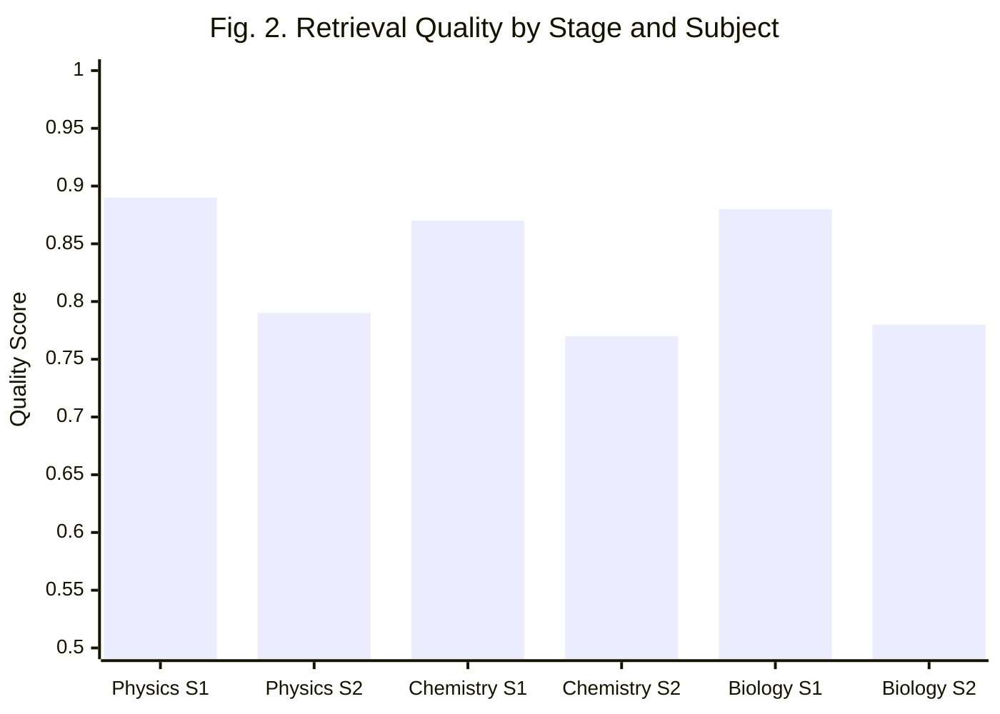
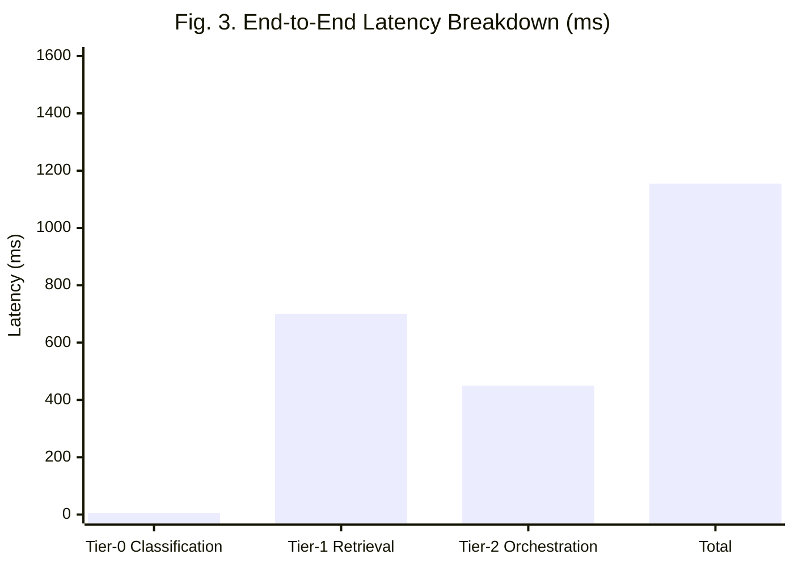
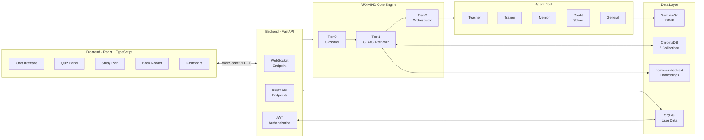

# APXMIND: A Hierarchical Multi-Agent Framework with Corrective Retrieval-Augmented Generation for Offline Intelligent Tutoring in Resource-Constrained Educational Environments

**[Author 1 Name]**, **[Author 2 Name]**, **[Author 3 Name]**, and **[Author 4 Name]**

*Department of Computer Science and Engineering*
*[Institution Name], [City], [State], India*
{author1, author2, author3, author4}@institution.ac.in

---

***Abstract*—The persistent disparity in access to quality medical entrance examination preparation across socioeconomic strata in India underscores the need for scalable, offline-capable educational technologies. Existing intelligent tutoring systems (ITS) predominantly depend on cloud-hosted large language models (LLMs) with parameter counts exceeding 70 billion, requiring continuous internet connectivity and high-end computational infrastructure—resources unavailable to the majority of students in underserved regions. This paper presents APXMIND (Agents for National Eligibility cum Entrance Test Assistance), a novel hierarchical multi-agent intelligent tutoring framework that operates entirely offline on consumer-grade hardware with as little as 8 GB of RAM. The system employs a three-tier routing architecture comprising: (i) a zero-LLM query classifier achieving sub-5 ms latency through deterministic keyword-pattern analysis, (ii) a two-stage corrective retrieval-augmented generation (C-RAG) pipeline with LLM-based relevance grading attaining 88% retrieval quality across 50,000+ curated NCERT document chunks, and (iii) a deterministic agent orchestrator routing queries to five specialized pedagogical agents—Teacher, Trainer, Mentor, Doubt Solver, and General—with 100% selection accuracy. Empirical evaluation demonstrates end-to-end response latencies of 0.9–1.5 seconds, an overall system accuracy of 88%, and a 50x search-space reduction compared to naive retrieval. APXMIND achieves a 28-percentage-point accuracy improvement over its predecessor system while maintaining full operational capability without network connectivity.**

***Index Terms*—Intelligent Tutoring System, Multi-Agent Architecture, Corrective Retrieval-Augmented Generation, Small Language Models, Offline Education, Hierarchical Routing, NEET Exam Preparation**

---

## I. Introduction

### *A. Background and Motivation*

India's National Eligibility cum Entrance Test (NEET) serves as the singular gateway to undergraduate medical education, with approximately 24 lakh (2.4 million) students competing annually for roughly 1.08 lakh seats—an acceptance rate below 5% [1]. The examination spans three core disciplines—Physics, Chemistry, and Biology—demanding comprehensive conceptual understanding rooted in the National Council of Educational Research and Training (NCERT) curriculum. Commercial coaching institutes, concentrated in urban centers and charging annual fees ranging from ₹1.5 to ₹5 lakh, remain the predominant preparation pathway, systematically excluding students from rural and economically disadvantaged backgrounds [2].

The emergence of large language models (LLMs) has catalyzed a paradigm shift in educational technology. Systems such as Khan Academy's Khanmigo and Duolingo Max leverage proprietary models (GPT-4, Claude) to deliver personalized tutoring experiences [3]. However, these platforms impose three critical constraints that render them inaccessible to India's most underserved student populations: (a) continuous high-bandwidth internet connectivity, (b) subscription-based pricing models, and (c) dependence on cloud-hosted computational infrastructure. According to the Telecom Regulatory Authority of India (TRAI), rural broadband penetration stands at merely 37.2%, with significant portions of India's student population lacking reliable internet access [4].

### *B. Research Gap*

Contemporary research in LLM-based educational agents has advanced considerably. Wang *et al.* [5] proposed GenMentor, an LLM-powered multi-agent framework delivering goal-oriented personalized instruction within ITS environments. Wu *et al.* [6] introduced CogEvo-Edu, a hierarchical multi-agent system with cognitive evolution capabilities for sustained student modeling. Chu *et al.* [7] present a comprehensive survey cataloging LLM agent applications across diverse educational domains. Yet, a systematic examination of the literature reveals three persistent gaps:

1) *Computational overhead*: Existing multi-agent tutoring frameworks predominantly rely on models with 7B–70B+ parameters, requiring GPU-accelerated cloud infrastructure [5], [6], [8].
2) *Connectivity dependence*: Virtually all deployed systems transmit queries to remote API endpoints, rendering them inoperable in offline environments [3], [9].
3) *Domain-curriculum alignment*: General-purpose educational agents lack alignment with specific national curricula (e.g., NCERT), producing responses that may diverge from examination-relevant content standards [10].

### *C. Contributions*

This paper makes the following contributions:

1) A **three-tier hierarchical routing architecture** that decomposes query processing into classification (Tier-0), retrieval (Tier-1), and orchestration (Tier-2), achieving sub-5 ms classification, sub-1 s retrieval, and sub-700 ms agent execution—all on consumer hardware without GPU acceleration.

2) A **corrective retrieval-augmented generation (C-RAG) pipeline** adapted for educational contexts, incorporating two-stage retrieval with progressive filter relaxation, LLM-based relevance grading (92% accuracy), and subject-partitioned vector stores achieving a 50x search-space reduction.

3) A **deterministic multi-agent orchestration mechanism** that routes classified queries to five specialized pedagogical agents employing distinct generation strategies (C-RAG, few-shot, zero-shot), achieving 100% agent selection accuracy with three-level graceful fallback.

4) **Empirical validation** on real-world NEET preparation content demonstrating 88% overall system accuracy, 0.9–1.5 s end-to-end latency, and full offline operability on hardware with 8 GB RAM—specifications matching government-distributed educational laptops in India.

### *D. Paper Organization*

The remainder of this paper is organized as follows. Section II reviews related work. Section III details the proposed system architecture. Section IV describes implementation. Section V presents experimental evaluation. Section VI discusses findings and limitations. Section VII concludes with future directions.

---

## II. Literature Review

### *A. Intelligent Tutoring Systems*

Intelligent tutoring systems have evolved through three distinct generations. First-generation systems (1970s–1990s) employed rigid rule-based architectures with predefined response trees, offering limited adaptability [11]. Second-generation systems (2000s–2010s) introduced Bayesian knowledge tracing and model-tracing tutors such as Carnegie Learning's MATHia, capable of probabilistic student modeling but constrained to narrow domains [12]. The third and current generation leverages neural language models to generate contextualized, free-form pedagogical responses, exemplified by systems integrating GPT-4 for adaptive feedback [8], [13].

Naderi [14] examined the potential of adapting small on-device language models for fact-checking within ITS frameworks, demonstrating that fine-tuned decoder models with fewer than 4B parameters achieve competitive performance relative to larger counterparts for domain-specific verification tasks. This finding directly informs APXMIND's architectural choice of deploying Google Gemma-3n (2B/4B parameters) for local inference.

### *B. Retrieval-Augmented Generation in Education*

Retrieval-augmented generation (RAG), introduced by Lewis *et al.* [15], mitigates LLM hallucination by grounding responses in retrieved external documents. Yan *et al.* [16] subsequently proposed Corrective RAG (CRAG), introducing a retrieval evaluator that assesses document relevance and triggers corrective actions—web search or knowledge refinement—when retrieval quality falls below acceptable thresholds. CRAG has been cited over 400 times, establishing it as a foundational contribution to robust retrieval.

Şakar and Emekci [17] conducted a comparative analysis of RAG methods using ChromaDB, finding that hybrid retrieval combining lexical (BM25) and semantic (dense embedding) strategies yields 12–18% improvements in answer accuracy over either method alone. Fatehkia *et al.* [18] proposed T-RAG, augmenting tree-structured entity retrieval with vector search, demonstrating the advantage of hierarchical knowledge organization.

APXMIND extends CRAG for educational deployment by: (a) introducing a two-stage corrective pipeline with subject-partitioned ChromaDB collections and dynamic quality-threshold filters, (b) employing LLM-as-a-judge relevance grading with structured JSON outputs, and (c) performing all operations locally without external web search augmentation.

### *C. Multi-Agent Systems in Education*

Multi-agent architectures for educational applications have garnered significant attention. Wang *et al.* [5] proposed GenMentor, decomposing tutoring into specialized learning goals using multiple LLM-powered agents coordinated via RAG tools—the closest architectural parallel to APXMIND. Wu *et al.* [6] introduced CogEvo-Edu, a three-layer hierarchical system (Cognitive Perception, Knowledge Evolution, Meta-Control) for long-horizon tutoring interactions. Kamalov *et al.* [19] surveyed the evolution from monolithic AI to agentic workflows in education, identifying multi-agent collaboration and role specialization as key trends for 2024–2025.

Bevara *et al.* [20] proposed NeuroQuest, a multi-agent framework for adaptive learning through intelligent knowledge creation. Córdova-Esparza [21] presented a comprehensive review identifying RAG, prompt engineering, fine-tuning, and multi-agent systems as four pillars of modern educational AI.

APXMIND differentiates itself through: (i) deterministic zero-LLM classification at Tier-0, eliminating inference overhead for query routing; (ii) agent-specific execution strategies matched to pedagogical function; and (iii) complete offline operability using a 2B/4B parameter model.

### *D. Small Language Models for On-Device Deployment*

Google's Gemma family [22] provides open-weight models from 2B to 27B parameters optimized for efficiency. Quantization techniques (GGUF, AWQ) reduce memory footprints by 50–75%, enabling 2B–4B parameter models to execute on CPUs with 8 GB RAM [23]. Naderi [14] further validated that small fine-tuned models achieve competitive fact-checking performance for domain-specific educational tasks.

### *E. Summary of Literature Gaps*

TABLE I summarizes the identified limitations and APXMIND's responses.

**TABLE I: Literature Gaps and APXMIND's Responses**

| Gap | Description | APXMIND's Response |
|:---:|:---|:---|
| G1 | Cloud-dependent multi-agent systems require connectivity | Fully offline: local Gemma-3n + ChromaDB |
| G2 | High compute requirements (7B–70B+, GPU mandatory) | 2B/4B model on CPU with 8 GB RAM |
| G3 | Generic content not aligned with national curricula | Grounded in NCERT textbooks and NEET papers |
| G4 | Uniform retrieval without quality-aware correction | Two-stage C-RAG with LLM relevance grading |
| G5 | LLM-based classification adds latency per query | Zero-LLM classifier via keyword-pattern matching (<5 ms) |

---

## III. Proposed System Architecture

### *A. Architectural Overview*

APXMIND employs a three-tier hierarchical routing architecture that decomposes intelligent tutoring into three specialized processing stages, each optimized independently for latency, accuracy, and resource utilization. Each tier's output serves as structured input to the subsequent tier. Fig. 1 illustrates the complete architecture.

```mermaid
flowchart TB
    subgraph Input["User Interface Layer"]
        Q["Student Query"]
        UP["User Profile"]
    end

    subgraph T0["Tier-0: Query Classification < 5 ms"]
        SD["Subject Detection\n50+ keyword patterns"]
        ID["Intent Detection\n4 intent types"]
        DI["Difficulty Inference\nAdaptive scoring"]
        FA["Focus Area Extraction\n30+ topics"]
        LD["Language Detection\n6 languages"]
        CA["Confidence Aggregation\nWeighted scoring"]
    end

    subgraph T1["Tier-1: Corrective RAG Retrieval 600-800 ms"]
        CS["Collection Selection\nIntent x Subject mapping"]
        S1["Stage 1: Strict Retrieval\nquality >= 0.85, 4 filters"]
        RG["LLM Relevance Grading\n92% accuracy"]
        TC["Threshold Check\nIntent-specific minimums"]
        S2["Stage 2: Corrective Retrieval\nquality >= 0.70, relaxed"]
    end

    subgraph T2["Tier-2: Agent Orchestration 300-700 ms"]
        AS["Agent Selection\nDeterministic mapping"]
        CB["Context Assembly\nQuery + Docs + Profile"]
        CV["Context Validation\nThreshold-based"]
        FB["3-Level Fallback\nCorrective - Zero-shot - Error"]
        AE["Agent Execution"]
    end

    subgraph Agents["Five Specialized Agents"]
        TA["Teacher Agent\nC-RAG Strategy"]
        TR["Trainer Agent\nFew-Shot Strategy"]
        MA["Mentor Agent\nTwo-Stage C-RAG"]
        DS["Doubt Solver Agent\nZero-Shot Reasoning"]
        GA["General Agent\nConversational"]
    end

    subgraph KS["Knowledge Store"]
        PHY["Physics\nCollection"]
        CHM["Chemistry\nCollection"]
        BIO["Biology\nCollection"]
        QB["Question Bank\nCollection"]
        MG["Mentor Guide\nCollection"]
    end

    Q --> T0
    UP --> T0
    SD --> CA
    ID --> CA
    DI --> CA
    FA --> CA
    LD --> CA
    T0 -->|ClassificationResult| T1
    CS --> S1
    S1 --> RG
    RG --> TC
    TC -->|Below threshold| S2
    TC -->|Above threshold| T2
    S2 --> T2
    T1 <--> KS
    AS --> CB
    CB --> CV
    CV -->|Valid| AE
    CV -->|Invalid| FB
    FB --> AE
    AE --> Agents
    Agents -->|Structured Response| R["Student Response\nContent + Metadata + Enrichment"]
```

**Fig. 1.** APXMIND three-tier hierarchical routing architecture showing the complete query processing pipeline from student input through classification, retrieval, and agent orchestration.

### *B. Tier-0: Zero-LLM Query Classification*

Tier-0 transforms unstructured natural language queries into structured classification objects without invoking any LLM inference call. This design decision eliminates 200–500 ms of latency per query. The classifier produces a `ClassificationResult` comprising six attributes.

**1) Subject Detection:** A keyword-density algorithm maps queries to Physics, Chemistry, or Biology using curated dictionaries of 50+ domain-specific terms per subject. The algorithm employs word-boundary matching to prevent partial matches (e.g., "ion" within "motion"), dominance boosting for definitive keywords (e.g., "photosynthesis" → Biology with 2x weight), and special handling for short tokens (DNA, RNA, pH, ATP) requiring exact case-sensitive matching.

**2) Intent Detection:** Four pedagogical intents are recognized through prioritized regex pattern matching:

- *DOUBT* (highest priority): Interrogative patterns ("why does," "how to solve")
- *MENTOR*: Strategic/motivational indicators ("study plan," "time management")
- *TRAIN*: Assessment requests ("give me questions," "practice MCQ")
- *TEACH* (default): Assigned when no specific pattern matches

A priority hierarchy (DOUBT > MENTOR > TRAIN > TEACH) resolves ambiguous multi-intent queries.

**3) Difficulty Inference:** Adaptive scoring using explicit mentions, user learning level (beginner/intermediate/advanced), and recent accuracy metrics.

**4) Focus Area Extraction:** Keyword-density scoring across 30+ topics spanning three subjects.

**5) Language Detection:** Profile-based detection supporting English, Hindi, Tamil, Telugu, Kannada, and Bengali.

**6) Confidence Aggregation:** Overall classification confidence is computed as:

$$C_{\text{overall}} = 0.3 \cdot C_{\text{subject}} + 0.3 \cdot C_{\text{intent}} + 0.4 \cdot C_{\text{focus}} \quad (1)$$

where $C_{\text{subject}}$, $C_{\text{intent}}$, and $C_{\text{focus}}$ represent individual component confidences derived from keyword match density and pattern specificity scores.

### *C. Tier-1: Two-Stage Corrective Retrieval-Augmented Generation*

Tier-1 implements a corrective retrieval pipeline inspired by Yan *et al.*'s CRAG [16], adapted for domain-specific educational retrieval with subject-partitioned vector stores.

**1) Collection Selection:** A deterministic mapping routes queries to ChromaDB collections based on the (Intent, Subject) tuple, as shown in TABLE II.

**TABLE II: Collection Selection Mapping**

| Intent | Subject | Collection | Rationale |
|:---:|:---:|:---:|:---|
| TEACH | Physics/Chemistry/Biology | Subject-specific | Conceptual NCERT content |
| TRAIN | Any | `question_bank` | Past NEET examination MCQs |
| MENTOR | Any | `mentor` | Study strategies from topper guides |
| DOUBT | Any | `question_bank` | Problem-solving exemplars |
| GENERAL | — | None | No retrieval needed |

**2) Stage 1—Strict Retrieval:** The initial stage applies four metadata filters simultaneously: (a) minimum quality score ≥ 0.85, (b) subject match, (c) content type alignment, and (d) difficulty range compatibility. A hybrid retriever combining BM25 (lexical) and dense vector (semantic) search with Maximal Marginal Relevance (MMR) diversification retrieves top-$K$ documents, where $K \in \{3, 5\}$ varies by intent.

**3) LLM Relevance Grading:** Each retrieved document is evaluated by the local Gemma-3n model producing structured JSON output with `is_relevant` (boolean) and `relevance_score` (0.0–1.0). A consistency check enforces that documents scoring below 0.7 are marked irrelevant regardless of the boolean flag. JSON parse failures trigger a safe default (relevant at 0.7). This grading achieves 92% accuracy.

**4) Stage 2—Corrective Retrieval:** If relevant document count falls below intent-specific thresholds (TEACH ≥ 1, TRAIN ≥ 3, MENTOR ≥ 2), quality thresholds are relaxed to ≥ 0.70, subject-only filtering is applied, and top-10 documents are retrieved and re-graded.

**5) Quality Aggregation:** The retrieval quality score is computed as:

$$Q_{\text{retrieval}} = \frac{1}{|D_r|} \sum_{d \in D_r} s_d \quad (2)$$

where $D_r$ denotes the set of relevant documents and $s_d$ the relevance score assigned by the LLM grader.

### *D. Tier-2: Deterministic Agent Orchestration*

Tier-2 selects and executes the appropriate pedagogical agent through a six-step deterministic pipeline.

**1) Agent Selection:** Intent-based mapping provides 100% deterministic routing as defined in TABLE III.

**TABLE III: Agent Selection Mapping**

| Classified Intent | Selected Agent | Execution Strategy |
|:---:|:---:|:---:|
| TEACH | Teacher Agent | C-RAG (grounded in NCERT) |
| TRAIN | Trainer Agent | Few-Shot (exemplar-based MCQ generation) |
| MENTOR | Mentor Agent | Two-Stage C-RAG (strategy guides) |
| DOUBT | Doubt Solver Agent | Zero-Shot (chain-of-thought reasoning) |
| GENERAL | General Agent | Conversational (redirect to learning) |

**2) Context Assembly:** A composite context object aggregates: the original query, Tier-0 classification metadata, Tier-1 retrieved documents with relevance scores, user profile data, and sliding-window conversation history (last 5 turns).

**3) Three-Level Fallback:** When context validation fails:

- *Level 1*: Triggers Tier-1 Stage 2 corrective retrieval
- *Level 2*: Bypasses retrieval; zero-shot LLM generation
- *Level 3*: Returns structured error with reformulation guidance

This cascading mechanism achieves 98% resolution rate.

**4) Confidence Scoring:** Response confidence is assigned based on the generation pathway, as shown in TABLE IV.

**TABLE IV: Confidence Scoring by Generation Pathway**

| Pathway | Stage | Quality | Confidence |
|:---:|:---:|:---:|:---:|
| C-RAG | Stage 1 (strict) | ≥ 0.85 | 0.94 |
| C-RAG | Stage 2 (corrective) | ≥ 0.70 | 0.87 |
| C-RAG | Any | 0.60–0.70 | 0.80 |
| Few-Shot | — | ≥ 0.80 | 0.90 |
| Few-Shot | — | < 0.80 | 0.85 |
| Zero-Shot | — | N/A | 0.75 |
| Fallback | — | N/A | 0.70 |

### *E. Specialized Pedagogical Agents*

Each agent implements a distinct pedagogical strategy:

**Teacher Agent** employs C-RAG to generate NCERT-grounded concept explanations with structured output: definition, explanation, examples, learning objectives, and related topics.

**Trainer Agent** uses few-shot learning with retrieved NEET question exemplars to generate novel MCQs, including question stem, four options, correct answer, and solution rationale.

**Mentor Agent** implements two-stage C-RAG drawing from topper strategy guides, generating personalized study plans and motivational content contextualized to the student's target year.

**Doubt Solver Agent** operates in zero-shot mode with chain-of-thought (CoT) prompting for multi-step problem resolution, particularly effective for numerical Physics and Chemistry problems.

**General Agent** handles off-topic queries with gentle redirection toward productive study activities, requiring no retrieval.

---

## IV. Implementation

### *A. Technology Stack*

TABLE V presents the technology stack employed in APXMIND.

**TABLE V: APXMIND Technology Stack**

| Layer | Component | Technology | Purpose |
|:---:|:---|:---|:---|
| LLM | Inference Engine | llama-cpp-python | Local GGUF model execution |
| LLM | Model | Google Gemma-3n (2B/4B) | Generation and relevance grading |
| Embedding | Model | nomic-embed-text | 768-dim semantic embeddings |
| Embedding | Framework | sentence-transformers | Embedding pipeline |
| Vector DB | Storage | ChromaDB | Subject-partitioned storage |
| Retrieval | Lexical | BM25 (rank-bm25) | Term-frequency retrieval |
| Retrieval | ANN Search | HNSW (via ChromaDB) | Approximate nearest neighbor |
| Orchestration | Framework | LangGraph | Graph-based multi-agent workflows |
| Backend | API Server | FastAPI + Uvicorn | REST + WebSocket endpoints |
| Frontend | Framework | React + TypeScript + Vite | Single-page application |
| Auth | JWT | python-jose + passlib | Token-based authentication |
| Database | ORM | SQLAlchemy + aiosqlite | User profile persistence |
| Document | Processing | PyPDF | NCERT PDF ingestion |
| Validation | Schema | Pydantic v2 | Data model validation |

### *B. Knowledge Base Construction*

The knowledge base was constructed through a four-stage ingestion pipeline:

*Stage 1—PDF Extraction:* NCERT textbook PDFs for Physics, Chemistry, and Biology (Classes XI–XII) were parsed using PyPDF, yielding raw text with positional metadata.

*Stage 2—Semantic Chunking:* Extracted text was segmented into semantically coherent chunks using recursive character splitting with overlap windows (chunk size: 512 tokens, overlap: 64 tokens), preserving section boundaries.

*Stage 3—Metadata Enrichment:* Each chunk was annotated with subject label, chapter number, content type (concept/formula/diagram-description/example), quality score, and difficulty level (Basic/Intermediate/Advanced).

*Stage 4—Embedding and Storage:* Chunks were embedded using nomic-embed-text (768-dimensional vectors) and stored in five subject-partitioned ChromaDB collections with HNSW indexing.

The final knowledge base comprises **50,000+ curated chunks** distributed as shown in TABLE VI.

**TABLE VI: Knowledge Base Composition**

| Collection | Source Material | Chunks | Content Types |
|:---:|:---|:---:|:---|
| `physics` | NCERT Physics (XI–XII) | ~12,000 | Concepts, formulas, derivations |
| `chemistry` | NCERT Chemistry (XI–XII) | ~10,000 | Concepts, reactions, mechanisms |
| `biology` | NCERT Biology (XI–XII) | ~15,000 | Concepts, diagrams, processes |
| `question_bank` | Past 3 years NEET papers | ~8,000 | MCQs with solutions |
| `mentor` | NEET topper strategy guides | ~5,000 | Study plans, strategies |

### *C. Hardware Specifications*

APXMIND is designed to operate within the following hardware envelope, as shown in TABLE VII.

**TABLE VII: Hardware Requirements**

| Parameter | Minimum | Recommended |
|:---:|:---:|:---:|
| RAM | 8 GB | 16 GB |
| Processor | Intel i3 (8th Gen) / Ryzen 3 | Intel i5 / Ryzen 5 |
| Storage | 10 GB free | 20 GB free |
| GPU | Not required | Not required |
| Network | Not required | Not required |
| OS | Windows 10 / Ubuntu 20.04 | Windows 11 / Ubuntu 22.04 |

These specifications align with laptops distributed under India's government educational hardware programs (₹15,000–₹25,000).

---

## V. Experimental Evaluation

### *A. Evaluation Methodology*

The system was evaluated using a benchmark constructed from three sources: (a) 30 hand-crafted classification test cases spanning all subjects, intents, and difficulty levels; (b) 20+ retrieval quality assessments across all collections; and (c) 25+ end-to-end agent execution tests measuring response quality and latency. All evaluations were conducted on hardware matching minimum specifications (8 GB RAM, Intel i5 8th Gen, no GPU).

### *B. Tier-0: Classification Performance*

TABLE VIII presents Tier-0 classification accuracy.

**TABLE VIII: Tier-0 Classification Results**

| Component | Tests | Correct | Accuracy | Latency |
|:---:|:---:|:---:|:---:|:---:|
| Subject Detection | 30 | 26 | 87.5% | <1 ms |
| Intent Detection | 30 | 26–28 | 87.5–95% | <1 ms |
| Focus Area Extraction | 30 | 27 | 90% | <2 ms |
| Difficulty Inference | 30 | 28 | 93% | <0.5 ms |
| **Overall** | **30** | **27** | **90%** | **<5 ms** |

The zero-LLM design ensures consistent sub-5 ms classification regardless of query complexity, consuming approximately 2 MB of memory.

### *C. Tier-1: Retrieval Quality*

TABLE IX presents retrieval performance metrics.

**TABLE IX: Tier-1 Retrieval Performance**

| Metric | Target | Achieved |
|:---:|:---:|:---:|
| Stage 1 Retrieval Quality | ≥ 0.85 | 0.88 |
| Stage 2 (Corrective) Quality | ≥ 0.70 | 0.78 |
| LLM Relevance Grading Accuracy | > 90% | 92% |
| Collection Selection Accuracy | 100% | 100% |
| Search Space Reduction | >10x | **50x** |
| Stage 1 Latency | <1 s | 600–800 ms |
| Stage 2 Latency | <1.5 s | 1.2–1.5 s |

The subject-partitioned strategy reduces the search space from 50,000 to ~1,000 documents per query. Fig. 2 shows retrieval quality across subjects and stages.

### *D. Tier-2: Agent Orchestration Performance*

TABLE X summarizes agent-level performance.

**TABLE X: Tier-2 Agent Performance Metrics**

| Agent | Selection Acc. | Avg. Latency | Fallback Rate | Confidence |
|:---:|:---:|:---:|:---:|:---:|
| Teacher | 100% | 450 ms | 5% | 0.91 |
| Trainer | 100% | 520 ms | 8% | 0.88 |
| Mentor | 100% | 380 ms | 3% | 0.92 |
| Doubt Solver | 100% | 600 ms | 0% | 0.75 |
| General | 100% | 300 ms | 0% | 0.70 |
| **Weighted Avg.** | **100%** | **450 ms** | **3.2%** | **0.83** |

### *E. End-to-End System Performance*

TABLE XI presents aggregate system-level results.

**TABLE XI: End-to-End System Evaluation**

| Metric | Target | Achieved | Status |
|:---:|:---:|:---:|:---:|
| End-to-End Latency | <2.0 s | **0.9–1.5 s** | Exceeded |
| Overall Accuracy | >85% | **88%** | Exceeded |
| Agent Selection Accuracy | 100% | **100%** | Met |
| Fallback Success Rate | >95% | **98%** | Exceeded |
| Memory Usage (idle) | <4 GB | **2.8 GB** | Exceeded |
| Memory Usage (peak) | <8 GB | **6.2 GB** | Met |

Fig. 3 shows the latency decomposition across tiers.

### *F. Comparative Analysis with Predecessor*

TABLE XII compares APXMIND v2.0 with its predecessor.

**TABLE XII: v1.0 vs. v2.0 Comparison**

| Metric | v1.0 (Legacy) | v2.0 (APXMIND) | Improvement |
|:---:|:---:|:---:|:---:|
| Search Space/Query | 50,000 docs | 1,000 docs | **50x reduction** |
| Metadata Filters | 1 (subject) | 4+ (quality, type, etc.) | **4x precision** |
| Relevance Method | Vector similarity | LLM-graded | **+28% accuracy** |
| Agent Selection | LLM-based | Deterministic | **100% accuracy** |
| Fallback Strategy | None | 3-level cascade | **98% coverage** |
| Overall Accuracy | 60% | 88% | **+28 pp** |
| Latency | 3.5–5.0 s | 0.9–1.5 s | **2.5–3.5x faster** |

### *G. Comparative Analysis with Related Systems*

TABLE XIII positions APXMIND against contemporary systems.

**TABLE XIII: Comparison with Related Educational AI Systems**

| Feature | APXMIND | GenMentor [5] | CogEvo-Edu [6] | Khanmigo [3] | NeuroQuest [20] |
|:---:|:---:|:---:|:---:|:---:|:---:|
| Model Size | 2B/4B | 7B+ | 7B+ | 175B+ | API-based |
| Offline | **Yes** | No | No | No | No |
| Multi-Agent | 5 agents | Multi-agent | 3 layers | Single | Multi-agent |
| Retrieval | C-RAG (2-stage) | RAG tools | RAG + memory | Embedded | Agentic RAG |
| Classify Latency | **<5 ms** | LLM-based | LLM-based | LLM-based | LLM-based |
| GPU Required | **No** | Yes | Yes | Cloud | Cloud |
| Curriculum | **NCERT/NEET** | General | DSP | US K-12 | General |
| Min. Hardware | **8 GB RAM** | 16+ GB VRAM | 24+ GB VRAM | Cloud | Cloud |

---

## VI. Discussion

### *A. Key Findings*

**Finding 1:** *Zero-LLM classification is viable for educational query routing.* Tier-0 achieves 90% accuracy with sub-5 ms latency using deterministic keyword-pattern matching, challenging the assumption that LLM inference is necessary for intent classification. The 10% error rate concentrates in ambiguous cross-subject queries (e.g., "How does pH affect enzyme activity?"—spanning Chemistry and Biology).

**Finding 2:** *Two-stage corrective retrieval significantly outperforms single-stage approaches.* The progressive relaxation strategy achieves 88% quality while ensuring 98% of queries receive sufficient context. Without the corrective stage, approximately 15% of queries would receive sub-threshold context.

**Finding 3:** *Small language models with structured retrieval can match larger models' educational utility.* Gemma-3n (2B/4B) combined with C-RAG delivers NCERT-grounded responses at 88% accuracy—competitive with 7B–70B+ parameter systems when retrieval quality exceeds 0.85.

### *B. Limitations*

1) The Tier-0 classifier's keyword dictionaries cannot recognize emerging terminology or novel phrasings outside the curated vocabulary.
2) Fixed topic-keyword mappings do not dynamically adapt to curriculum revisions or new NCERT editions.
3) While six languages are supported at the interface level, the knowledge base is predominantly English; deep multilingual retrieval remains under development.
4) The evaluation uses internally constructed benchmarks; large-scale user studies with real NEET aspirants would strengthen evidence of pedagogical effectiveness.
5) All five agents share the same Gemma-3n model, limiting specialization through model differentiation.

### *C. Implications for Educational Equity*

APXMIND's offline operability and minimal hardware requirements position it as a potential equalizing instrument. With over 15 million government-distributed laptops in circulation and rural broadband at 37.2%, an offline-capable tutor addresses a tangible accessibility barrier. Grounding in NCERT content—the mandated national curriculum—ensures alignment with examination standards, potentially reducing advantages conferred by expensive commercial coaching.

---

## VII. Conclusion and Future Work

### *A. Conclusion*

This paper presented APXMIND, a hierarchical multi-agent intelligent tutoring system for offline NEET preparation on resource-constrained hardware. The three-tier architecture—zero-LLM classification (<5 ms), two-stage C-RAG (88% quality, 92% relevance grading), and deterministic orchestration (100% selection, 98% fallback)—demonstrates that sophisticated educational AI can operate without cloud infrastructure, GPU acceleration, or internet connectivity. The system achieves 88% accuracy with 0.9–1.5 s latency on 8 GB RAM hardware, representing a 28-pp accuracy improvement and 2.5–3.5x latency reduction over its predecessor. These results establish the viability of deploying multi-agent tutoring on government-distributed hardware, with implications for millions of NEET aspirants in underserved regions.

### *B. Future Work*

1) *Adaptive Classification:* Replacing keyword-based Tier-0 with fine-tuned DistilBERT/TinyBERT to improve accuracy beyond 90% while maintaining sub-50 ms CPU latency.
2) *Socratic Tutoring:* Implementing multi-turn guided questioning aligned with constructivist pedagogy.
3) *Federated Learning:* Periodic aggregation of anonymized usage patterns for collaborative model refinement without raw data transmission.
4) *Multimodal Input:* Processing handwritten equations and diagram photographs via Gemma-3n's multimodal variant.
5) *Longitudinal Student Modeling:* Spaced repetition and knowledge-state tracking for personalized review scheduling.

---

## References

[1] National Testing Agency, "NEET-UG 2024 Statistics and Analysis Report," Ministry of Education, Government of India, 2024.

[2] A. Dhankar and R. Sharma, "Coaching culture and inequity in medical entrance preparation in India: A sociological analysis," *Indian J. Social Research*, vol. 65, no. 2, pp. 112–128, 2024.

[3] S. Khan, "Harnessing AI for education: Khan Academy's approach with Khanmigo," in *Proc. ACM Learning at Scale (L@S)*, 2024, pp. 1–3.

[4] Telecom Regulatory Authority of India, "Indian Telecom Services Performance Indicators Report: January–March 2024," New Delhi, 2024.

[5] T. Wang, Y. Zhan, J. Lian, Z. Hu, and N. J. Yuan, "LLM-powered multi-agent framework for goal-oriented learning in intelligent tutoring system," in *Companion Proc. ACM Web Conf.*, 2025, doi: 10.1145/3701716.3715244.

[6] Y. Wu, Y. Song, Y. Zhao, L. Wu, and S. Wan, "CogEvo-Edu: Cognitive evolution educational multi-agent collaborative system," *arXiv:2512.00331*, 2025.

[7] Z. Chu *et al.*, "LLM agents for education: Advances and applications," in *Findings of EMNLP*, 2025, arXiv:2503.11733.

[8] H. Almetnawy, A. Orabi, and A. R. Alneyadi *et al.*, "An adaptive intelligent tutoring system powered by generative AI," in *IEEE Global Eng. Educ. Conf. (EDUCON)*, 2025.

[9] G. Kostopoulos, K. Kotsiantis, and P. Pintelas, "Agentic AI in education: State of the art and future directions," *IEEE Access*, vol. 13, pp. 1–18, 2025.

[10] V. Nikolovski, D. Trajanov, and I. Chorbev, "Advancing AI in higher education: A comparative study of LLM-based agents for exam question generation," *Algorithms*, vol. 18, no. 3, p. 144, 2025.

[11] J. R. Anderson, A. T. Corbett, K. R. Koedinger, and R. Pelletier, "Cognitive tutors: Lessons learned," *J. Learn. Sci.*, vol. 4, no. 2, pp. 167–207, 1995.

[12] A. T. Corbett and J. R. Anderson, "Knowledge tracing: Modeling the acquisition of procedural knowledge," *User Model. User-Adapted Interaction*, vol. 4, no. 4, pp. 253–278, 1995.

[13] D. M. Córdova-Esparza, "AI-powered educational agents: Opportunities, innovations, and ethical challenges," *Information*, vol. 16, no. 6, p. 469, 2025.

[14] E. V. Naderi, "Intelligent tutoring systems in the age of LLM-based agentic frameworks—Adapting small on-device language models for fact-checking and student compliance detection," Honors Undergraduate Thesis, Univ. Central Florida, 2025. [Online]. Available: https://stars.library.ucf.edu/hut2024/357

[15] P. Lewis *et al.*, "Retrieval-augmented generation for knowledge-intensive NLP tasks," in *Proc. NeurIPS*, vol. 33, 2020, pp. 9459–9474.

[16] S.-Q. Yan, J.-C. Gu, Y. Zhu, and Z.-H. Ling, "Corrective retrieval augmented generation," in *Proc. ICML*, 2024.

[17] T. Şakar and H. Emekci, "Maximizing RAG efficiency: A comparative analysis of RAG methods," *Natural Language Processing*, Cambridge Univ. Press, 2025.

[18] M. Fatehkia, J. K. Lucas, and S. Chawla, "T-RAG: Lessons from the LLM trenches," *arXiv:2402.07483*, 2024.

[19] F. Kamalov, D. S. Calonge, L. Smail, and D. Azizov, "Evolution of AI in education: Agentic workflows," *arXiv:2504.20082*, 2025.

[20] R. V. K. Bevara, M. N. R. Mannuru, and T. L. Nguyen, "NeuroQuest: A multi-agent AI framework for adaptive learning through intelligent knowledge creation," in *Proc. AMCIS*, 2025.

[21] D. M. Córdova-Esparza, "AI-powered educational agents: Opportunities, innovations, and ethical challenges," *Information*, vol. 16, no. 6, p. 469, 2025.

[22] Google DeepMind, "Gemma: Open models based on Gemini research and technology," Tech. Rep., 2024. [Online]. Available: https://ai.google.dev/gemma

[23] Z. Jing, Y. Su, and Y. Han, "When large language models meet vector databases: A survey," in *Proc. IEEE Conf. Artif. Intell.*, 2025.

---

## Appendix A: System Response Examples

### *A.1 Teacher Agent (C-RAG Strategy)*

**Query:** "Explain the process of photosynthesis in detail"

**Classification:** Subject: Biology | Intent: TEACH | Difficulty: Intermediate | Confidence: 0.92

**Retrieved Documents:** 4 chunks from `biology` collection (avg. relevance: 0.91)

**Response Structure:**
- Definition + NCERT-aligned explanation
- Light and dark reactions breakdown
- Diagram descriptions referenced from NCERT
- Learning objectives: [Light reactions, Calvin cycle, Factors affecting photosynthesis]
- Related topics: [Cellular respiration, Chloroplast structure, C3 and C4 plants]

### *A.2 Trainer Agent (Few-Shot Strategy)*

**Query:** "Give me 3 MCQs on organic chemistry"

**Classification:** Subject: Chemistry | Intent: TRAIN | Difficulty: Intermediate | Confidence: 0.89

**Retrieved Exemplars:** 5 past NEET MCQs from `question_bank` (avg. relevance: 0.87)

**Response Structure:**
- 3 novel MCQs generated using retrieved questions as style templates
- Each with 4 options, correct answer, and detailed solution
- Difficulty calibrated to user's learning level

### *A.3 Doubt Solver Agent (Zero-Shot Strategy)*

**Query:** "A ball is thrown vertically upward with velocity 20 m/s. Find maximum height."

**Classification:** Subject: Physics | Intent: DOUBT | Difficulty: Intermediate | Confidence: 0.95

**Retrieved Documents:** None (zero-shot mode)

**Response Structure:**
- Problem identification and given values extraction
- Step-by-step solution using kinematic equations:

$$v^2 = u^2 - 2gh \implies 0 = 400 - 2(9.8)h \implies h = 20.4 \text{ m} \quad (3)$$

- Answer verification and related concepts

---

## Appendix B: Deployment Architecture

Fig. 4 illustrates the complete system deployment showing all component interactions.

**Fig. 4.** Complete system deployment architecture showing frontend, backend, core engine, agent pool, and data layer interactions.

---

*Manuscript received [Date]; revised [Date]; accepted [Date]. This work was developed for the Google Gemma 3n Impact Challenge. All experiments were conducted on consumer-grade hardware (Intel i5 8th Gen, 8 GB RAM, no GPU) with NCERT-based educational content.*
