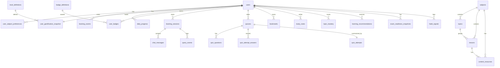

# APXMIND Real-Time Data Schema Blueprint

## 1) Objective

Replace frontend mock/local-only state with persistent, real-time, queryable backend data that powers:

- Dashboard metrics (XP, level, streak, today progress, weekly heatmap)
- Study plan and NEET countdown
- Quiz lifecycle and answer review
- Learn chat history and tutor analytics
- Achievements/badges
- Profile-driven personalization
- Library (bookmarks + notes)

---

## 2) UI → Data Coverage Matrix

| UI Screen       | Data Shown                                                               | Persisted Source                                                               |
|-----------------|--------------------------------------------------------------------------|--------------------------------------------------------------------------------|
| Welcome/Login   | local profiles list                                                      | `users`                                                                        |
| Dashboard       | total XP, level, XP to next, streak, today lessons/quizzes/minutes/XP, badges count | `user_gamification_snapshot`, `daily_progress`, `user_badges`    |
| App Shell       | XP, level, streak, user basics                                           | `user_gamification_snapshot`, `users`                                          |
| Study Plan      | daily target, today progress, 7-day heatmap, streak, days until exam     | `users`, `daily_progress`, `user_gamification_snapshot`                        |
| Achievements    | badge catalog, earned badges, earnedAt, longest streak, XP progress      | `badge_definitions`, `user_badges`, `user_gamification_snapshot`               |
| Profile         | profile + target + daily target + language + strengths/weaknesses        | `users`, `user_subject_preferences`                                            |
| Learn (chat)    | user/assistant messages, tutor tier metadata                             | `learning_sessions`, `chat_messages`, `query_events`                           |
| Quiz            | setup, generated quiz, answers, correctness, explanation, final score    | `quizzes`, `quiz_questions`, `quiz_attempt_answers`, `quiz_attempts`           |
| Library         | bookmarks + notes                                                        | `bookmarks`, `study_notes`                                                     |

---

## 3) Core Schema

---

### 3.1 Identity & Profile

#### `users`
| Column                    | Type              | Constraints / Default          | Notes                                    |
|---------------------------|-------------------|-------------------------------|------------------------------------------|
| `id`                      | BIGSERIAL         | PK                            |                                          |
| `username`                | VARCHAR(50)       | UNIQUE NOT NULL               | Login handle (unique, immutable)         |
| `name`                    | VARCHAR(100)      | NOT NULL                      | Display name (non-unique)                |
| `email`                   | VARCHAR(120)      | UNIQUE NULL                   | NULL allowed; NULLs do not conflict      |
| `password_hash`           | VARCHAR(256)      | NOT NULL                      | bcrypt / argon2 output                   |
| `avatar_url`              | TEXT              | NULL                          |                                          |
| `dob`                     | DATE              | NULL                          |                                          |
| `current_class`           | VARCHAR(20)       | NULL                          | `11th` / `12th` / `dropper`              |
| `attempt_number`          | SMALLINT          | NULL                          | Which NEET attempt (1st, 2nd, …)         |
| `target_year`             | SMALLINT          | NULL                          |                                          |
| `target_score`            | SMALLINT          | NULL                          |                                          |
| `daily_study_target_hours`| NUMERIC(4,1)      | DEFAULT 4                     |                                          |
| `preferred_language`      | VARCHAR(20)       | DEFAULT `english`             |                                          |
| `learning_level`          | VARCHAR(20)       | DEFAULT `beginner`            | `beginner` / `intermediate` / `advanced` |
| `timezone`                | VARCHAR(64)       | DEFAULT `Asia/Kolkata`        |                                          |
| `created_at`              | TIMESTAMPTZ       | NOT NULL DEFAULT now()        |                                          |
| `updated_at`              | TIMESTAMPTZ       | NOT NULL DEFAULT now()        |                                          |
| `last_active_at`          | TIMESTAMPTZ       | NULL                          |                                          |
| `deleted_at`              | TIMESTAMPTZ       | NULL                          | Soft delete; NULL = active               |

---

#### `user_subject_preferences`
| Column          | Type        | Constraints / Default | Notes                                  |
|-----------------|-------------|----------------------|----------------------------------------|
| `id`            | BIGSERIAL   | PK                   |                                        |
| `user_id`       | BIGINT      | FK → `users.id`      |                                        |
| `subject`       | VARCHAR(20) | NOT NULL             | `physics` / `chemistry` / `biology`    |
| `strength`      | VARCHAR(10) | NOT NULL             | `strong` / `weak` / `neutral`          |
| `priority_rank` | SMALLINT    | NULL                 | 1 = highest priority                   |
| UNIQUE          | —           | (`user_id`, `subject`) |                                      |

---

### 3.2 Content Catalog

#### `subjects`
| Column         | Type        | Constraints / Default | Notes |
|----------------|-------------|----------------------|-------|
| `id`           | BIGSERIAL   | PK                   |       |
| `code`         | VARCHAR(20) | UNIQUE NOT NULL      | `physics` / `chemistry` / `biology` |
| `display_name` | VARCHAR(50) | NOT NULL             |       |
| `description`  | TEXT        | NULL                 |       |

---

#### `topics`
| Column       | Type         | Constraints / Default | Notes                             |
|--------------|--------------|----------------------|-----------------------------------|
| `id`         | BIGSERIAL    | PK                   |                                   |
| `subject_id` | BIGINT       | FK → `subjects.id`   |                                   |
| `name`       | VARCHAR(120) | NOT NULL             | e.g. "Laws of Motion"             |
| `syllabus_weight` | NUMERIC(5,2) | NULL            | % weight in NEET syllabus         |
| UNIQUE       | —            | (`subject_id`, `name`) |                                 |

---

#### `lessons`
| Column              | Type         | Constraints / Default | Notes                       |
|---------------------|--------------|----------------------|-----------------------------|
| `id`                | BIGSERIAL    | PK                   |                             |
| `subject_id`        | BIGINT       | FK → `subjects.id`   |                             |
| `topic_id`          | BIGINT       | FK → `topics.id` NULL |                            |
| `title`             | VARCHAR(200) | NOT NULL             |                             |
| `description`       | TEXT         | NULL                 |                             |
| `difficulty`        | VARCHAR(20)  | DEFAULT `medium`     | `easy` / `medium` / `hard`  |
| `sequence_no`       | INT          | NOT NULL             |                             |
| `estimated_minutes` | INT          | DEFAULT 30           |                             |
| INDEX               | —            | (`subject_id`, `sequence_no`) |                    |

---

#### `content_resources`
| Column          | Type        | Constraints / Default | Notes                                          |
|-----------------|-------------|----------------------|------------------------------------------------|
| `id`            | BIGSERIAL   | PK                   |                                                |
| `lesson_id`     | BIGINT      | FK → `lessons.id` NULL | NULL = subject-level resource               |
| `subject_id`    | BIGINT      | FK → `subjects.id`   |                                                |
| `resource_type` | VARCHAR(30) | NOT NULL             | `ncert` / `chapter` / `pyq` / `video` / `note` |
| `title`         | VARCHAR(255)| NOT NULL             |                                                |
| `source_path`   | TEXT        | NOT NULL             |                                                |
| `meta`          | JSONB       | NULL                 |                                                |

---

### 3.3 Real-Time Activity Event Layer (Append-Only Source of Truth)

#### `learning_events`
All user activity is appended here. Gamification aggregates are derived from this table.

| Column            | Type         | Constraints / Default       | Notes                                                 |
|-------------------|--------------|-----------------------------|-------------------------------------------------------|
| `id`              | BIGSERIAL    | PK                          |                                                       |
| `user_id`         | BIGINT       | FK → `users.id` NOT NULL    |                                                       |
| `idempotency_key` | VARCHAR(128) | UNIQUE NULL                 | Prevents duplicate XP on retries                      |
| `event_type`      | VARCHAR(40)  | NOT NULL                    | See event types below                                 |
| `subject`         | VARCHAR(20)  | NULL                        |                                                       |
| `entity_type`     | VARCHAR(30)  | NULL                        | `lesson` / `quiz` / `session` / `message`             |
| `entity_id`       | VARCHAR(64)  | NULL                        | Stores UUID or BIGINT as string                       |
| `event_value`     | NUMERIC(10,2)| NULL                        | Minutes, XP, score, etc.                              |
| `payload`         | JSONB        | NOT NULL DEFAULT `{}`       | Arbitrary structured metadata                         |
| `occurred_at`     | TIMESTAMPTZ  | NOT NULL DEFAULT now()      |                                                       |

**Allowed `event_type` values:**
- `study_session_recorded`
- `lesson_completed`
- `quiz_completed`
- `quiz_answer_submitted`
- `chat_query_sent`
- `chat_response_received`
- `badge_earned`
- `bookmark_added`
- `bookmark_removed`
- `note_created`
- `note_updated`
- `note_deleted`

**Indexes:**
- (`user_id`, `occurred_at DESC`)
- (`event_type`, `occurred_at DESC`)
- (`subject`, `occurred_at DESC`)
- (`user_id`, `event_type`, `occurred_at DESC`)

---

### 3.4 Gamification & Progress Read Models

#### `level_definitions`
| Column         | Type        | Constraints / Default | Notes                         |
|----------------|-------------|----------------------|-------------------------------|
| `level`        | INT         | PK                   | 1, 2, 3, …                    |
| `xp_required`  | INT         | NOT NULL             | Total XP needed to reach this level |
| `label`        | VARCHAR(50) | NOT NULL             | e.g. "Beginner", "Scholar"    |

---

#### `daily_progress`
Denormalized daily snapshot updated by stream processor or background job.

| Column               | Type        | Constraints / Default       | Notes                            |
|----------------------|-------------|----------------------------|----------------------------------|
| `id`                 | BIGSERIAL   | PK                         |                                  |
| `user_id`            | BIGINT      | FK → `users.id`            |                                  |
| `date`               | DATE        | NOT NULL                   |                                  |
| `study_minutes`      | INT         | NOT NULL DEFAULT 0         |                                  |
| `lessons_completed`  | INT         | NOT NULL DEFAULT 0         |                                  |
| `quizzes_taken`      | INT         | NOT NULL DEFAULT 0         |                                  |
| `xp_earned`          | INT         | NOT NULL DEFAULT 0         |                                  |
| `subjects_studied`   | JSONB       | NOT NULL DEFAULT `[]`      | Array of subject codes studied   |
| UNIQUE               | —           | (`user_id`, `date`)        |                                  |
| INDEX                | —           | (`user_id`, `date DESC`)   |                                  |

---

#### `user_gamification_snapshot`
One row per user for ultra-fast dashboard reads.

| Column            | Type        | Constraints / Default       | Notes                                      |
|-------------------|-------------|----------------------------|--------------------------------------------|
| `user_id`         | BIGINT      | PK FK → `users.id`         |                                            |
| `total_xp`        | INT         | NOT NULL DEFAULT 0         |                                            |
| `current_level`   | INT         | NOT NULL DEFAULT 1         | FK → `level_definitions.level`             |
| `xp_to_next_level`| INT         | NOT NULL DEFAULT 500       | Recomputed when level changes              |
| `current_streak`  | INT         | NOT NULL DEFAULT 0         | Consecutive study days                     |
| `longest_streak`  | INT         | NOT NULL DEFAULT 0         |                                            |
| `last_study_date` | DATE        | NULL                       |                                            |
| `updated_at`      | TIMESTAMPTZ | NOT NULL DEFAULT now()     |                                            |

---

#### `badge_definitions`
| Column        | Type         | Constraints          | Notes                            |
|---------------|--------------|---------------------|----------------------------------|
| `id`          | VARCHAR(50)  | PK                  | Slug: `first_lesson`, `streak_7` |
| `name`        | VARCHAR(100) | NOT NULL            |                                  |
| `description` | TEXT         | NOT NULL            |                                  |
| `icon`        | VARCHAR(16)  | NOT NULL            | Emoji or icon code               |
| `criteria`    | JSONB        | NOT NULL            | e.g. `{"streak_days": 7}`        |

---

#### `user_badges`
| Column      | Type        | Constraints                    | Notes |
|-------------|-------------|-------------------------------|-------|
| `id`        | BIGSERIAL   | PK                            |       |
| `user_id`   | BIGINT      | FK → `users.id`               |       |
| `badge_id`  | VARCHAR(50) | FK → `badge_definitions.id`   |       |
| `earned_at` | TIMESTAMPTZ | NOT NULL                      |       |
| UNIQUE      | —           | (`user_id`, `badge_id`)       |       |

---

### 3.5 Quiz Model

#### `quizzes`
| Column           | Type        | Constraints / Default       | Notes                                   |
|------------------|-------------|----------------------------|-----------------------------------------|
| `id`             | UUID        | PK DEFAULT gen_random_uuid()  |                                      |
| `user_id`        | BIGINT      | FK → `users.id`            |                                         |
| `subject`        | VARCHAR(20) | NOT NULL                   |                                         |
| `topic`          | VARCHAR(120)| NULL                       | Optional topic filter                   |
| `difficulty`     | VARCHAR(20) | NOT NULL                   | `easy` / `medium` / `hard` / `mixed`    |
| `question_count` | INT         | NOT NULL                   |                                         |
| `time_limit_sec` | INT         | NULL                       | NULL = untimed                          |
| `status`         | VARCHAR(20) | NOT NULL DEFAULT `active`  | `active` / `completed` / `abandoned`    |
| `started_at`     | TIMESTAMPTZ | NOT NULL DEFAULT now()     |                                         |
| `completed_at`   | TIMESTAMPTZ | NULL                       |                                         |

---

#### `quiz_questions`
| Column          | Type         | Constraints / Default | Notes                           |
|-----------------|--------------|----------------------|---------------------------------|
| `id`            | BIGSERIAL    | PK                   |                                 |
| `quiz_id`       | UUID         | FK → `quizzes.id`    |                                 |
| `question_no`   | INT          | NOT NULL             | 1-indexed order                 |
| `question_text` | TEXT         | NOT NULL             |                                 |
| `options`       | JSONB        | NOT NULL             | `["A","B","C","D"]`             |
| `correct_answer`| TEXT         | NOT NULL             | Must match one of `options`     |
| `explanation`   | TEXT         | NULL                 |                                 |
| `topic`         | VARCHAR(120) | NULL                 |                                 |
| `difficulty`    | VARCHAR(20)  | NULL                 | Question-level difficulty       |
| UNIQUE          | —            | (`quiz_id`, `question_no`) |                           |

---

#### `quiz_attempt_answers`
| Column          | Type        | Constraints / Default       | Notes                               |
|-----------------|-------------|----------------------------|-------------------------------------|
| `id`            | BIGSERIAL   | PK                         |                                     |
| `quiz_id`       | UUID        | FK → `quizzes.id`          |                                     |
| `question_id`   | BIGINT      | FK → `quiz_questions.id`   |                                     |
| `user_answer`   | TEXT        | NOT NULL                   |                                     |
| `is_correct`    | BOOLEAN     | NOT NULL                   |                                     |
| `score_awarded` | INT         | NOT NULL DEFAULT 0         |                                     |
| `time_taken_sec`| INT         | NULL                       | Per-question time                   |
| `evaluated_at`  | TIMESTAMPTZ | NOT NULL DEFAULT now()     |                                     |
| UNIQUE          | —           | (`quiz_id`, `question_id`) | One answer per question per attempt |

---

#### `quiz_attempts`
Final summary row for a completed quiz.

| Column             | Type         | Constraints / Default    | Notes                            |
|--------------------|--------------|-------------------------|----------------------------------|
| `id`               | BIGSERIAL    | PK                      |                                  |
| `quiz_id`          | UUID         | UNIQUE FK → `quizzes.id`|                                  |
| `user_id`          | BIGINT       | FK → `users.id`         |                                  |
| `subject`          | VARCHAR(20)  | NOT NULL                |                                  |
| `difficulty`       | VARCHAR(20)  | NOT NULL                |                                  |
| `correct_answers`  | INT          | NOT NULL                |                                  |
| `total_questions`  | INT          | NOT NULL                |                                  |
| `score_percent`    | NUMERIC(5,2) | NOT NULL                |                                  |
| `xp_awarded`       | INT          | NOT NULL                |                                  |
| `time_taken_sec`   | INT          | NULL                    |                                  |
| `created_at`       | TIMESTAMPTZ  | NOT NULL DEFAULT now()  |                                  |

---

### 3.6 Learn Chat / Tutor Analytics

#### `learning_sessions`
| Column      | Type        | Constraints / Default   | Notes                             |
|-------------|-------------|------------------------|-----------------------------------|
| `id`        | UUID        | PK                     |                                   |
| `user_id`   | BIGINT      | FK → `users.id`        |                                   |
| `subject`   | VARCHAR(20) | NOT NULL               |                                   |
| `lesson_id` | BIGINT      | FK → `lessons.id` NULL |                                   |
| `started_at`| TIMESTAMPTZ | NOT NULL DEFAULT now() |                                   |
| `ended_at`  | TIMESTAMPTZ | NULL                   |                                   |

> `duration_minutes` is intentionally omitted — derive as `EXTRACT(EPOCH FROM (ended_at - started_at)) / 60`.

---

#### `chat_messages`
| Column       | Type        | Constraints / Default   | Notes                                      |
|--------------|-------------|------------------------|--------------------------------------------|
| `id`         | BIGSERIAL   | PK                     |                                            |
| `session_id` | UUID        | FK → `learning_sessions.id` |                                       |
| `role`       | VARCHAR(20) | NOT NULL               | `user` / `assistant` / `system`            |
| `content`    | TEXT        | NOT NULL               |                                            |
| `tier`       | VARCHAR(20) | NULL                   | `tier-0` / `tier-1` / `tier-2` / `langgraph` |
| `metadata`   | JSONB       | NULL                   | latency, confidence, sources               |
| `created_at` | TIMESTAMPTZ | NOT NULL DEFAULT now() |                                            |
| INDEX        | —           | (`session_id`, `created_at`) |                                      |

---

#### `query_events`
Denormalized analytics per AI query — supports weak-topic detection.

| Column       | Type         | Constraints / Default   | Notes                        |
|--------------|--------------|------------------------|------------------------------|
| `id`         | BIGSERIAL    | PK                     |                              |
| `user_id`    | BIGINT       | FK → `users.id`        |                              |
| `session_id` | UUID         | FK → `learning_sessions.id` NULL |                  |
| `query_text` | TEXT         | NOT NULL               |                              |
| `subject`    | VARCHAR(20)  | NULL                   |                              |
| `intent`     | VARCHAR(50)  | NULL                   |                              |
| `tier`       | VARCHAR(20)  | NULL                   |                              |
| `confidence` | NUMERIC(5,4) | NULL                   |                              |
| `latency_ms` | INT          | NULL                   |                              |
| `sources`    | JSONB        | NULL                   |                              |
| `created_at` | TIMESTAMPTZ  | NOT NULL DEFAULT now() |                              |

---

### 3.7 Library

#### `bookmarks`
| Column      | Type         | Constraints / Default   | Notes                      |
|-------------|--------------|------------------------|----------------------------|
| `id`        | UUID         | PK                     |                            |
| `user_id`   | BIGINT       | FK → `users.id`        |                            |
| `title`     | VARCHAR(255) | NOT NULL               |                            |
| `subject`   | VARCHAR(20)  | NOT NULL               |                            |
| `lesson_id` | BIGINT       | FK → `lessons.id` NULL |                            |
| `path`      | TEXT         | NULL                   | Deep link / route          |
| `saved_at`  | TIMESTAMPTZ  | NOT NULL DEFAULT now() |                            |
| `updated_at`| TIMESTAMPTZ  | NOT NULL DEFAULT now() |                            |

---

#### `study_notes`
| Column       | Type         | Constraints / Default   | Notes                              |
|--------------|--------------|------------------------|------------------------------------|
| `id`         | UUID         | PK                     |                                    |
| `user_id`    | BIGINT       | FK → `users.id`        |                                    |
| `title`      | VARCHAR(255) | NOT NULL               |                                    |
| `content`    | TEXT         | NOT NULL               |                                    |
| `subject`    | VARCHAR(20)  | NULL                   |                                    |
| `tags`       | JSONB        | NOT NULL DEFAULT `[]`  | e.g. `["important","revision"]`    |
| `color`      | VARCHAR(20)  | NULL                   | UI label color for organization    |
| `created_at` | TIMESTAMPTZ  | NOT NULL DEFAULT now() |                                    |
| `updated_at` | TIMESTAMPTZ  | NOT NULL DEFAULT now() |                                    |

---

### 3.8 Personalization

#### `topic_mastery`
| Column             | Type         | Constraints / Default | Notes                  |
|--------------------|--------------|-----------------------|------------------------|
| `id`               | BIGSERIAL    | PK                    |                        |
| `user_id`          | BIGINT       | FK → `users.id`       |                        |
| `subject`          | VARCHAR(20)  | NOT NULL              |                        |
| `topic`            | VARCHAR(120) | NOT NULL              |                        |
| `mastery_score`    | NUMERIC(5,2) | NOT NULL DEFAULT 0    | 0–100                  |
| `confidence`       | NUMERIC(5,2) | NOT NULL DEFAULT 0    | 0–100                  |
| `last_assessed_at` | TIMESTAMPTZ  | NULL                  |                        |
| UNIQUE             | —            | (`user_id`, `subject`, `topic`) |             |

---

#### `learning_recommendations`
| Column           | Type         | Constraints / Default     | Notes                                                |
|------------------|--------------|--------------------------|------------------------------------------------------|
| `id`             | BIGSERIAL    | PK                       |                                                      |
| `user_id`        | BIGINT       | FK → `users.id`          |                                                      |
| `rec_type`       | VARCHAR(40)  | NOT NULL                 | `lesson` / `quiz` / `revision` / `routine`           |
| `subject`        | VARCHAR(20)  | NULL                     |                                                      |
| `topic`          | VARCHAR(120) | NULL                     |                                                      |
| `title`          | VARCHAR(255) | NOT NULL                 |                                                      |
| `reason`         | TEXT         | NOT NULL                 |                                                      |
| `priority_score` | NUMERIC(6,3) | NOT NULL                 |                                                      |
| `status`         | VARCHAR(20)  | NOT NULL DEFAULT `active`| `active` / `accepted` / `dismissed` / `completed`    |
| `generated_at`   | TIMESTAMPTZ  | NOT NULL DEFAULT now()   |                                                      |
| `expires_at`     | TIMESTAMPTZ  | NULL                     |                                                      |

---

#### `exam_readiness_snapshots`
| Column                      | Type         | Constraints / Default | Notes                      |
|-----------------------------|--------------|----------------------|----------------------------|
| `id`                        | BIGSERIAL    | PK                   |                            |
| `user_id`                   | BIGINT       | FK → `users.id`      |                            |
| `snapshot_date`             | DATE         | NOT NULL             |                            |
| `projected_score`           | NUMERIC(5,1) | NULL                 |                            |
| `syllabus_coverage_percent` | NUMERIC(5,2) | NULL                 |                            |
| `accuracy_percent`          | NUMERIC(5,2) | NULL                 |                            |
| `speed_qph`                 | NUMERIC(6,2) | NULL                 | Questions per hour         |
| `consistency_score`         | NUMERIC(5,2) | NULL                 |                            |
| `risk_band`                 | VARCHAR(20)  | NULL                 | `low` / `medium` / `high`  |
| UNIQUE                      | —            | (`user_id`, `snapshot_date`) |                   |

---

#### `habit_signals`
| Column                | Type        | Constraints / Default | Notes                              |
|-----------------------|-------------|----------------------|------------------------------------|
| `id`                  | BIGSERIAL   | PK                   |                                    |
| `user_id`             | BIGINT      | FK → `users.id`      |                                    |
| `date`                | DATE        | NOT NULL             |                                    |
| `first_activity_at`   | TIMESTAMPTZ | NULL                 |                                    |
| `last_activity_at`    | TIMESTAMPTZ | NULL                 |                                    |
| `session_count`       | INT         | NOT NULL DEFAULT 0   |                                    |
| `deep_focus_minutes`  | INT         | NOT NULL DEFAULT 0   |                                    |
| `interruptions_count` | INT         | NOT NULL DEFAULT 0   | Optional; requires explicit signal |
| UNIQUE                | —           | (`user_id`, `date`)  |                                    |

---

## 4) Entity Relationship Diagram



---

## 5) CRUD Operations

> **Legend:**
> - `{id}` = resource primary key in path
> - `[body]` = JSON request body fields
> - `[query]` = URL query parameters
> - `*` = required field

---

### 5.1 Auth & Profile

#### Authentication

| Operation        | Method | Path                  | Body / Params                                                    | Notes                           |
|------------------|--------|-----------------------|------------------------------------------------------------------|---------------------------------|
| Register         | POST   | `/api/auth/register`  | `username*`, `name*`, `password*`, `email`                       | Returns JWT + user              |
| Login            | POST   | `/api/auth/login`     | `username*`, `password*`                                         | Returns JWT + user              |
| Refresh token    | POST   | `/api/auth/refresh`   | `refresh_token*`                                                 |                                 |
| Logout           | POST   | `/api/auth/logout`    | —                                                                | Invalidates refresh token       |

---

#### User Profile

| Operation              | Method | Path                       | Body / Params                                                                                                     | Notes                          |
|------------------------|--------|----------------------------|-------------------------------------------------------------------------------------------------------------------|--------------------------------|
| Get own profile        | GET    | `/api/profile`             | —                                                                                                                 | Returns current user           |
| Update profile         | PATCH  | `/api/profile`             | `name`, `email`, `avatar_url`, `dob`, `current_class`, `attempt_number`, `target_year`, `target_score`, `daily_study_target_hours`, `preferred_language`, `learning_level`, `timezone` | Partial update |
| Delete account         | DELETE | `/api/profile`             | —                                                                                                                 | Soft delete (`deleted_at`)     |
| Get subject preferences| GET    | `/api/profile/subjects`    | —                                                                                                                 |                                |
| Set subject preference | PUT    | `/api/profile/subjects/{subject}` | `strength*`, `priority_rank`                                                                               | Upsert                         |
| Delete subject preference | DELETE | `/api/profile/subjects/{subject}` | —                                                                                                        |                                |

---

### 5.2 Dashboard & Progress

| Operation                  | Method | Path                          | Body / Params              | Notes                              |
|----------------------------|--------|-------------------------------|----------------------------|------------------------------------|
| Get dashboard summary      | GET    | `/api/dashboard/summary`      | —                          | XP, level, streak, today totals    |
| Get daily progress         | GET    | `/api/progress/daily`         | `[days=7]`, `[from]`, `[to]` | Heatmap and stats                |
| Get gamification snapshot  | GET    | `/api/progress/gamification`  | —                          | Full snapshot row                  |
| Record study minutes       | POST   | `/api/progress/study-minutes` | `minutes*`, `subject*`, `date` | Appends `learning_event`       |

---

### 5.3 Learning Sessions & Chat

#### Sessions

| Operation      | Method | Path                          | Body / Params                          | Notes                             |
|----------------|--------|-------------------------------|----------------------------------------|-----------------------------------|
| Start session  | POST   | `/api/learn/sessions`         | `subject*`, `lesson_id`                | Returns session UUID              |
| Get session    | GET    | `/api/learn/sessions/{id}`    | —                                      |                                   |
| End session    | PATCH  | `/api/learn/sessions/{id}/end`| —                                      | Sets `ended_at`                   |
| List sessions  | GET    | `/api/learn/sessions`         | `[subject]`, `[limit=20]`, `[cursor]`  | Paginated                         |
| Delete session | DELETE | `/api/learn/sessions/{id}`    | —                                      | Removes session + messages        |

---

#### Chat Messages

| Operation           | Method | Path                                    | Body / Params                | Notes                                  |
|---------------------|--------|-----------------------------------------|------------------------------|----------------------------------------|
| Send message        | POST   | `/api/learn/sessions/{id}/messages`     | `content*`, `role*`          | Triggers AI response                   |
| Get messages        | GET    | `/api/learn/sessions/{id}/messages`     | `[limit=50]`, `[cursor]`     | Paginated, oldest-first                |
| Delete message      | DELETE | `/api/learn/sessions/{id}/messages/{msg_id}` | —                       | Soft/hard delete single message        |
| Clear chat history  | DELETE | `/api/learn/sessions/{id}/messages`     | —                            | Wipe all messages in a session         |

---

### 5.4 Quiz

#### Quiz Lifecycle

| Operation                | Method | Path                              | Body / Params                                              | Notes                              |
|--------------------------|--------|-----------------------------------|------------------------------------------------------------|------------------------------------|
| Start quiz               | POST   | `/api/quiz`                       | `subject*`, `difficulty*`, `question_count*`, `time_limit_sec`, `topic` | Returns quiz + all questions |
| Get quiz                 | GET    | `/api/quiz/{quiz_id}`             | —                                                          | Returns quiz metadata              |
| Get quiz questions       | GET    | `/api/quiz/{quiz_id}/questions`   | —                                                          | Returns all questions              |
| Submit answer            | POST   | `/api/quiz/{quiz_id}/answers`     | `question_id*`, `user_answer*`                             | Returns `is_correct`, `explanation` |
| Update answer            | PUT    | `/api/quiz/{quiz_id}/answers/{question_id}` | `user_answer*`                                   | Change answer before finishing     |
| Finish quiz              | POST   | `/api/quiz/{quiz_id}/finish`      | —                                                          | Creates `quiz_attempts` row, awards XP |
| Abandon quiz             | PATCH  | `/api/quiz/{quiz_id}/abandon`     | —                                                          | Sets status = `abandoned`          |

---

#### Quiz History & Review

| Operation                | Method | Path                              | Body / Params                             | Notes                              |
|--------------------------|--------|-----------------------------------|-------------------------------------------|------------------------------------|
| List past quizzes        | GET    | `/api/quiz`                       | `[subject]`, `[status]`, `[limit=20]`, `[cursor]` | Paginated history          |
| Get quiz results         | GET    | `/api/quiz/{quiz_id}/results`     | —                                         | Score, answers, explanations       |
| Delete quiz              | DELETE | `/api/quiz/{quiz_id}`             | —                                         | Removes quiz + questions + answers |

---

### 5.5 Achievements

| Operation            | Method | Path                      | Body / Params | Notes                              |
|----------------------|--------|---------------------------|---------------|------------------------------------|
| Get all badges       | GET    | `/api/achievements`       | —             | Catalog + earned status + earnedAt |
| Get earned badges    | GET    | `/api/achievements/earned`| —             | Only badges the user has earned    |
| Get badge detail     | GET    | `/api/achievements/{badge_id}` | —        | Criteria, description, progress    |

---

### 5.6 Library — Bookmarks

| Operation          | Method | Path                        | Body / Params                                             | Notes                     |
|--------------------|--------|-----------------------------|-----------------------------------------------------------|---------------------------|
| List bookmarks     | GET    | `/api/library/bookmarks`    | `[subject]`, `[limit=20]`, `[cursor]`                    | Paginated                 |
| Get bookmark       | GET    | `/api/library/bookmarks/{id}` | —                                                       |                           |
| Create bookmark    | POST   | `/api/library/bookmarks`    | `title*`, `subject*`, `lesson_id`, `path`                | Appends `bookmark_added` event |
| Update bookmark    | PATCH  | `/api/library/bookmarks/{id}` | `title`, `subject`, `lesson_id`, `path`                 | Partial update            |
| Delete bookmark    | DELETE | `/api/library/bookmarks/{id}` | —                                                       | Appends `bookmark_removed` event |
| Delete all bookmarks | DELETE | `/api/library/bookmarks`  | —                                                         | Bulk delete               |

---

### 5.7 Library — Study Notes

| Operation      | Method | Path                         | Body / Params                                                      | Notes                       |
|----------------|--------|------------------------------|--------------------------------------------------------------------|-----------------------------|
| List notes     | GET    | `/api/library/notes`         | `[subject]`, `[tags]`, `[color]`, `[q]` (search), `[limit=20]`, `[cursor]` | Paginated, filterable |
| Get note       | GET    | `/api/library/notes/{id}`    | —                                                                  |                             |
| Create note    | POST   | `/api/library/notes`         | `title*`, `content*`, `subject`, `tags`, `color`                   | Appends `note_created` event |
| Update note    | PUT    | `/api/library/notes/{id}`    | `title`, `content`, `subject`, `tags`, `color`                     | Full or partial update; appends `note_updated` event |
| Delete note    | DELETE | `/api/library/notes/{id}`    | —                                                                  | Appends `note_deleted` event |
| Bulk delete notes | DELETE | `/api/library/notes`      | `ids*` (array of UUIDs)                                            |                             |

---

### 5.8 Recommendations

| Operation                  | Method | Path                                    | Body / Params | Notes                                        |
|----------------------------|--------|-----------------------------------------|---------------|----------------------------------------------|
| Get recommendations        | GET    | `/api/recommendations`                  | `[type]`, `[subject]`, `[limit=10]` | Active, priority-sorted      |
| Accept recommendation      | PATCH  | `/api/recommendations/{id}/accept`      | —             | Sets status = `accepted`                     |
| Dismiss recommendation     | PATCH  | `/api/recommendations/{id}/dismiss`     | —             | Sets status = `dismissed`                    |
| Mark completed             | PATCH  | `/api/recommendations/{id}/complete`    | —             | Sets status = `completed`                    |

---

### 5.9 Topic Mastery

| Operation               | Method | Path                                | Body / Params                         | Notes                         |
|-------------------------|--------|-------------------------------------|---------------------------------------|-------------------------------|
| Get mastery overview    | GET    | `/api/mastery`                      | `[subject]`                           | All topics with scores        |
| Get topic mastery       | GET    | `/api/mastery/{subject}/{topic}`    | —                                     |                               |
| Upsert topic mastery    | PUT    | `/api/mastery/{subject}/{topic}`    | `mastery_score*`, `confidence*`        | System-driven; also callable  |

---

### 5.10 Exam Readiness

| Operation                  | Method | Path                             | Body / Params     | Notes                              |
|----------------------------|--------|----------------------------------|-------------------|------------------------------------|
| Get latest snapshot        | GET    | `/api/readiness`                 | —                 | Most recent readiness values       |
| Get snapshot history       | GET    | `/api/readiness/history`         | `[days=30]`       | Trend data for charts              |

---

## 6) Real-Time Update Pattern

```
Client action
    │
    ▼
Backend writes canonical row
    │
    ├─► Append to learning_events (with idempotency_key)
    │
    ▼
Stream worker / async task updates:
    ├── daily_progress
    ├── user_gamification_snapshot
    └── user_badges  (check badge criteria)
    │
    ▼
Push via WebSocket / SSE:
    topic: user:{user_id}:dashboard
    │
    ▼
UI subscribes → patches state instantly
```

This removes mock-state drift and gives consistent multi-device behavior with no stale reads.

---

## 7) Migration Path from Current State

1. Keep existing `users`, `subjects`, `lessons`, `progress`, `quiz_attempts`.
2. Add `username` column to `users`; populate from `name`; add UNIQUE constraint.
3. Add new tables in order:
   - `topics`, `level_definitions`
   - `learning_events`, `daily_progress`, `user_gamification_snapshot`
   - `badge_definitions`, `user_badges`
   - `bookmarks`, `study_notes`
   - `learning_sessions`, `chat_messages`, `query_events`
   - `quizzes`, `quiz_questions`, `quiz_attempt_answers`, `quiz_attempts`
   - `topic_mastery`, `learning_recommendations`, `exam_readiness_snapshots`, `habit_signals`
4. Add `lesson_id` FK to `content_resources`.
5. Backfill `daily_progress` and `user_gamification_snapshot` from existing rows.
6. Seed `level_definitions` with XP thresholds.
7. Move frontend reads from Zustand persisted local values to API endpoints.
8. Add live dashboard stream endpoint (SSE / WebSocket).

---

## 8) Implementation Notes

- **Database:** PostgreSQL + JSONB for flexible metadata; transactional writes everywhere.
- **Event log:** `learning_events` is append-only. Never update or delete rows.
- **Idempotency:** Always pass `idempotency_key` when appending events to prevent duplicate XP on retries.
- **XP rules:** Maintain the XP award table on the backend only — never in frontend code.
- **Level thresholds:** Drive all level-up logic from `level_definitions`; recalculate `xp_to_next_level` on the snapshot whenever `total_xp` crosses a boundary.
- **Soft deletes:** `users.deleted_at` is the only soft-delete. Cascade to owned data via foreign key or background job.
- **Caching:** Cache `/api/dashboard/summary` per user for 5–15 s to handle burst reads without hitting the snapshot table on every render.
- **Personalization tables** (`topic_mastery`, `exam_readiness_snapshots`, `habit_signals`) are optional for MVP but are required for adaptive quiz generation and weak-topic revision.
